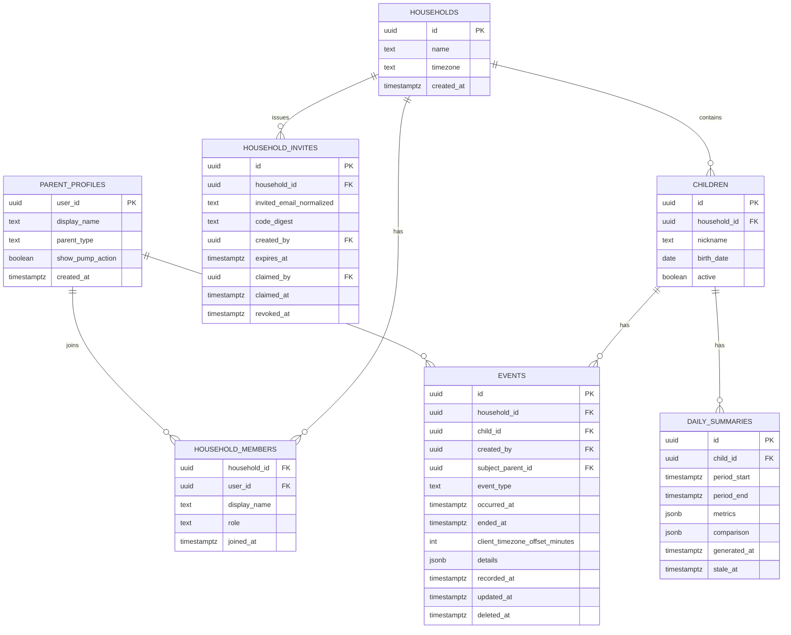

# Baby Infant Log — Product and UX Specification

**Status:** Approved implementation baseline  
**Implementation status:** MVP implementation created; external Supabase and Netlify provisioning remains  
**Primary users:** Two parents using iOS Safari and Android Chrome  
**Hosting target:** Netlify  
**Data and authentication target:** Supabase  
**Last updated:** July 11, 2026

## 1. Product definition

Baby Infant Log is a private, mobile-first web app that lets either parent record infant care events while actively caring for the baby. Its central promise is:

> Open the app, tap one large action, and know the event is safely shared.

The app tracks these seven actions:

1. Poop
2. Pee
3. Feed
4. Burp
5. Sleep / Wake
6. Diaper check
7. Pump / End pump

The product is intentionally narrow. Speed, clarity, data safety, and reliable shared state matter more than customization or decorative design.

## 2. Launch scope and assumptions

### 2.1 Accounts and family membership

The first release uses standard email-and-password accounts. It does not hard-code or allowlist specific email addresses.

- **Parent A** creates an account, a parent profile, and the infant's family record.
- The system generates a short-lived five-character alphanumeric family signup code.
- **Parent B** creates and verifies a separate account, enters the code, reviews the family being joined, and confirms the link.
- Both parents then have equal permission to view, log, edit, and remove events for that family.
- Each account belongs to only one family in the MVP, and each family has one infant and at most two active parent memberships.

The family code creates membership only through a protected server-side claim transaction. It is not a child ID, database key, permanent password, or substitute for Parent B's own authenticated account.

**Family** is the user-facing term. **Household** is the corresponding internal database boundary used in this document's technical sections.

### 2.2 Product assumptions to confirm

This specification makes the following default decisions so implementation can remain unblocked:

- One infant and one household are supported at launch.
- A parent profile type is required: Mother, Father, or Parent/Guardian. This is a display and personalization preference, not an authorization role.
- The 8 PM brief covers the rolling 24-hour period ending at 8:00 PM in the household's saved timezone.
- The 8 PM brief is guaranteed to exist in the app. Proactive delivery by email or push notification is not part of the MVP until a delivery channel is chosen.
- Feed, diaper, Pump, and other detailed attributes are optional after the event has already been logged; details never block the first tap.
- Baby nickname is required. Date of birth is optional because the app does not need it for core logging.
- The app provides patterns and factual comparisons, not diagnoses, medical thresholds, or clinical advice.

## 3. Goals and non-goals

### 3.1 Goals

- Log Poop, Pee, Feed, Burp, and Diaper check with exactly one tap from the home screen.
- Start and stop Sleep with one tap for each transition.
- Start and stop Pump with one tap for each transition, then optionally add amount and side.
- Show confirmation immediately, without waiting for the network.
- Keep both parents' screens synchronized within seconds when online.
- Never silently lose a tap during a slow or interrupted connection.
- Make mistakes easy to undo or edit without making every correct action slower.
- Provide readable Day, Week, and Month views for every tracked action.
- Generate a factual, meaningful 8 PM daily brief.
- Prevent any user outside the claimed family membership from accessing infant data.
- Work well as a normal browser tab and as an installed home-screen web app.

### 3.2 Non-goals for MVP

- Multiple infants per family or switching between multiple families from one account
- Native iOS or Android apps
- Medical recommendations, alerts, or developmental guidance
- AI-generated health interpretations
- Medication, temperature, growth, milk inventory, or appointment tracking
- Photo uploads, free-form journals, or attachments
- Wearable or smart-device integration
- Complex caregiver roles or custody workflows
- Social features, public sharing, or leaderboards

## 4. Experience principles

1. **The default action is immediate.** A primary CTA records an event; it does not open a form.
2. **Recovery replaces confirmation.** Show Undo after logging rather than asking “Are you sure?” before logging.
3. **One-handed use is the baseline.** Primary actions sit in the easiest thumb-reach area and have large targets.
4. **Status must be unambiguous without adding noise.** The top bar shows Offline only when attention is needed; event-level pending/error states remain visible in activity.
5. **Optional detail stays optional.** A parent can add context after the core timestamp is secure.
6. **Color is supportive, not semantic by itself.** Text, icons, shapes, and status words carry meaning.
7. **Fatigue is expected.** Copy is short, controls are stable, and no important action depends on memory, precision, hover, or long-press.

## 5. Information architecture

The app has three persistent primary destinations:

- **Log:** one-tap actions, current sleep state, sync state, and recent activity
- **History:** chronological event list with edit, delete, and date navigation
- **Trends:** action graphs, Day/Week/Month filters, and daily briefs

Settings are opened from a small text or gear control in the top bar rather than occupying a fourth bottom-navigation item.

The bottom navigation remains fixed above the device safe area. Labels are always visible; icons are not used without text.

## 6. Primary screen specification

### 6.1 Home / Log screen

```text
┌──────────────────────────────────┐
│ Baby Log               Offline   │  ← only when offline
│ Hi Dad,                           │
│ Baby nickname’s day               │
│                                  │
│ [ Poop ]       [ Pee ]           │
│ [ Feed ]       [ Burp ]          │
│ [ Sleep ]      [ Diaper check ]  │
│ [ Sleep Interrupted — active ]   │
│ [ Pump / End pump — Mother ]      │
│                                  │
│ Quick update                     │
│ Last poop 42m · pee 18m · feed 1h│
│                                  │
│ Recent                           │
│ 2:14 PM  Feed              You   │
│ 1:52 PM  Pee          Other parent│
│ 1:08 PM  Wake · slept 48m  You   │
│                                  │
│ Log          History      Trends │
└──────────────────────────────────┘
```

This is a structural wireframe, not a visual style recommendation.

### 6.2 Action grid

- Two columns in portrait mode and three columns only when width comfortably allows it.
- The six shared actions appear without scrolling on common phone sizes whenever practical.
- Pump appears as a full-width seventh action below the shared grid for a Mother profile by default. Its visibility is a parent preference and remains stable after onboarding.
- Each button is at least 64 CSS pixels high with at least 12 pixels between targets.
- Button order never changes automatically. Stable placement prevents tired users from tapping the wrong action.
- Each action uses a simple line icon plus a visible text label.
- Do not use emoji as the only iconography because rendering differs across iOS and Android.
- No long-press behavior is required or hidden.
- Press feedback begins immediately and completes in roughly 100–150 ms; there is no decorative animation.

Recommended fixed order:

| Position | Action | Reason |
|---|---|---|
| Top left | Poop | Frequent diaper-related action |
| Top right | Pee | Frequent diaper-related action |
| Middle left | Feed | Frequent care action |
| Middle right | Burp | Naturally adjacent to Feed |
| Bottom left | Sleep / Wake | Stateful action with a changing label |
| Bottom right | Diaper check | Related to but distinct from Poop/Pee |
| Full-width personalized row | Pump / End pump | Visible by default for Mother; stateful and visually separate from infant actions |

### 6.3 Standard one-tap event behavior

Poop, Pee, Feed, Burp, and Diaper check follow this sequence:

1. On a valid tap, the browser captures the current client timestamp immediately.
2. A client-generated UUID is assigned before any network request.
3. The recent-activity list updates optimistically.
4. A bottom message appears: **“Pee logged”**, with an **Undo** action.
5. The event is submitted to Supabase.
6. The event-level status clears when acknowledged; the Log header does not continuously display “Saved.”
7. Supabase Realtime updates the other parent's open app.

There is no pre-log modal, amount selector, outcome selector, or confirmation step.

### 6.4 Accidental duplicate protection

- Ignore a second activation of the same CTA from the same device for 600 ms.
- Use the client UUID as the idempotency key so a retry cannot create a duplicate.
- Do not merge events merely because both parents log the same action near the same time; those might be valid independent observations.
- Surface unusually close duplicate events in History for easy cleanup, but do not silently delete them.

### 6.5 Undo and edit

- Undo remains directly available for at least five seconds after logging.
- Undo is implemented as a soft deletion so the system can recover from sync races and preserve auditability.
- Tapping a recent event opens a compact edit sheet for time and optional details.
- Both parents may correct household events. History always shows who originally recorded the event and whether it was edited.

### 6.6 Quick update

- The Log screen shows compact elapsed-time values for the most recent Poop, Pee, and Feed.
- Each value uses the newest non-deleted shared event regardless of which parent recorded it.
- Values use short fatigue-friendly wording such as **18m ago**, **2h 15m ago**, or **1d 4h ago**.
- The elapsed display updates locally and does not write to the database.
- When an action has no history, show **Not logged yet** rather than an invented value.
- Fifteen minutes after the latest Feed, show **No burp yet · Last feed was Xm ago** only when no non-deleted Burp has been recorded after that Feed.
- Either parent's Burp entry clears the reminder immediately; a newer Feed starts a new 15-minute window.

## 7. Action-specific behavior

### 7.1 Poop

Default: record one Poop event at the client timestamp.

Optional post-log details:

- Small / medium / large
- Color or consistency only if explicitly wanted later; exclude from initial MVP to avoid unnecessary health-oriented data and UI

### 7.2 Pee

Default: record one Pee event at the client timestamp.

No required details in MVP.

### 7.3 Feed

Default: record that a Feed occurred at the client timestamp.

Optional post-log details:

- Milk type: breast milk, formula, or mixed
- Amount consumed in milliliters

The Feed timestamp is saved on the first tap before its optional details sheet opens. Closing the sheet or choosing **Save without amount** retains the Feed. No amount is interpreted as unknown, not zero.

### 7.4 Burp

Default: record one Burp event at the client timestamp.

No required details in MVP.

### 7.5 Sleep / Wake

Sleep is a stateful CTA:

- When the infant is awake, the button reads **Sleep**.
- Tapping it starts a sleep session using the current client timestamp.
- While sleep is active, the same button reads **Wake · 1h 12m** and uses the Attention state.
- Tapping Wake ends the open sleep session at the current client timestamp.
- The elapsed label is display-only and can update once per minute; it must not cause a network write every minute.
- While Sleep is active, a separate **Sleep Interrupted** control starts an interruption using one tap.
- During an open interruption, that control changes to **Resume sleep · Xm**; one tap closes the interruption without ending the sleep session.
- Tapping Wake while an interruption is open closes both at the same timestamp.
- History, Trends, and the daily brief show net sleep time and interruption count. Gross session timestamps remain preserved.

Concurrency rules:

- Only one open sleep session may exist for a child.
- Only one interruption may be open for that sleep session.
- Starting or ending sleep must use a transactional database operation.
- If both parents tap Sleep nearly simultaneously, one operation succeeds and the other device adopts the already-active sleep state instead of creating a second open session.
- If the app is offline, a sleep transition is queued. On reconnection, conflicts are shown clearly and resolved without silently overwriting timestamps.

### 7.6 Diaper check

Default: record that a diaper was checked at the client timestamp.

Optional post-log outcome:

- Dry
- Wet
- Soiled
- Mixed
- Rash noticed

Poop and Pee remain independent action events. Selecting an outcome must not automatically create additional Poop/Pee events unless a future setting explicitly enables that behavior; implicit event creation would make counts confusing.

### 7.7 Pump / End pump

Pump is a stateful, parent-specific CTA shown by default on the Mother profile:

- When no pumping session is active, the button reads **Pump**.
- Tapping it starts a Pump session using the current client timestamp.
- While active, it reads **End pump · 12m** and uses the Attention state.
- Tapping End pump closes the session at the current client timestamp and immediately saves the duration.
- The success message reads **“Pump saved · 18m”** with **Undo** and **Add amount** actions.
- The other parent may view and correct Pump records, but the primary Pump CTA is personalized to the Mother profile.

Optional post-log details:

- Total amount
- Unit: milliliters or fluid ounces, remembered as a parent preference
- Left amount and right amount, where useful
- Left, right, or both when only side is being recorded

Rules:

- Amount is never required to end and save a Pump session.
- If left and right amounts are entered, total is derived automatically; the form does not ask for the same total twice.
- Preserve the entered value and unit, and also store a canonical milliliter value for consistent aggregation and later unit switching.
- Missing amount is displayed as “Not recorded” and is never counted as zero.
- Only one open Pump session may exist per pumping parent profile.
- The session is associated with the family and infant for shared trends while retaining the pumping parent's profile ID.
- Pump and Feed remain separate actions; ending Pump must not automatically create a Feed event.
- Offline Pump transitions use the same visible queue and conflict-recovery rules as Sleep.

## 8. Time and event semantics

The user's requirement to capture client time is preserved while retaining a server audit timestamp.

Each event stores:

- `occurred_at`: ISO timestamp captured on the client at tap time
- `recorded_at`: trusted database timestamp assigned when Supabase accepts the write
- `client_timezone_offset_minutes`: device offset at tap time
- `household_timezone`: resolved through the household, stored as an IANA name such as `America/Chicago`
- `created_by`: authenticated Supabase user ID
- `subject_parent_id`: pumping parent profile for Pump events; otherwise null
- `id`: client-generated event UUID used as both the primary key and idempotency key

Rules:

- The UI displays events in the household timezone, not whichever timezone the server uses.
- Editing an event changes `occurred_at` and records `updated_at`; it never rewrites `recorded_at`.
- If the device clock differs substantially from server time, save the event but mark it for review. Do not silently substitute server time because the product explicitly uses client time.
- Day, Week, and Month boundaries use the household timezone.
- Sleep and Pump durations are calculated from timestamp instants, which avoids daylight-saving arithmetic errors.

## 9. Shared and offline behavior

### 9.1 Online shared state

- An acknowledged event appears on the other parent's open screen through an authenticated, household-scoped Supabase Realtime channel.
- The recent list identifies the recording parent using a short display name, never the full email address.
- Realtime is an enhancement, not the only source of truth. The app refetches the latest household state on focus, reconnect, and session restoration.

### 9.2 Optimistic and offline queue

The app must not silently discard an event because of poor connectivity.

- Pending events are stored in IndexedDB under the authenticated user and household.
- A pending event remains visibly marked **Syncing** or **Offline**.
- Retries occur when the browser reports online, when the tab returns to the foreground, and when the app is reopened.
- Retry uses the same UUID, making it safe to submit more than once.
- A failed authorization or household-membership check is never retried indefinitely; it shows **Needs attention** and asks the user to sign in again.
- Do not depend exclusively on Background Sync because behavior is not uniform across iOS Safari and Android Chrome.
- The local queue contains only the minimum event payload. Avoid locally caching emails, full profiles, or unnecessary sensitive details.

## 10. Feedback and error states

| State | UI treatment | Parent action |
|---|---|---|
| Saved | Activity has no warning; no persistent success label | None |
| Syncing | Small spinner plus “Syncing”; event remains visible | None |
| Offline | Attention-colored “Offline · events will sync” | Continue logging |
| Needs attention | Persistent short message beside affected event | Retry or sign in |
| Undo complete | “Event removed” with brief Restore action | Optional restore |
| Email not verified | “Check your email to finish creating your account.” | Resend after cooldown |
| Invalid family code | “That code is invalid, expired, or already used.” | Re-enter or ask Parent A for a new code |
| Join rate limited | “Too many attempts. Try again in 15 minutes.” | Wait; Parent A may rotate the code |
| Sleep conflict | “Sleep was already started at 2:14 PM.” | Keep existing time or edit |
| Pump conflict | “A pump session is already active.” | Continue or correct the existing session |

Never show raw Supabase, Postgres, authentication, SMTP, or Netlify error text to the parent. Preserve technical detail only in protected logs.

## 11. History

History is a reverse-chronological list grouped by household date.

Each row shows:

- Action label and icon
- Local time
- Parent display name
- Duration for completed sleep sessions
- Net duration and interruption count for completed sleep sessions
- Edited, Offline, or Needs attention status when applicable

Controls:

- Today is the default.
- Previous/next date buttons have full text or clear accessible names.
- Filter by action using a compact selector; “All” is the default.
- Selecting a row opens Edit and Remove actions.
- Empty state: **“No events logged for this day.”**

The main one-tap logging grid does not disappear when History is opened via browser Back; navigation state must behave predictably.

## 12. Trends and graph interface

### 12.1 Controls

The Trends screen has two control groups:

1. Action: Poop, Pee, Feed, Burp, Sleep, Diaper check, Pump
2. Range: Day, Week, Month

The current action and range are expressed in visible text and accessible state, not color alone. Date navigation uses previous/next arrows plus a centered date label.

### 12.2 Chart mapping

| Action | Day | Week | Month | Headline metric |
|---|---|---|---|---|
| Poop | Dots on 24-hour timeline | Count per day | Count per day | Count and median interval |
| Pee | Dots on 24-hour timeline | Count per day | Count per day | Count and median interval |
| Feed | Dots on 24-hour timeline | Count per day | Count per day | Count, median feed interval, and recorded ml |
| Burp | Dots on 24-hour timeline | Count per day | Count per day | Count |
| Sleep | Horizontal sleep intervals | Net hours per day | Net hours per day | Net sleep, sessions, interruptions, longest stretch |
| Diaper check | Dots on 24-hour timeline | Count per day | Count per day | Checks and optional outcomes |
| Pump | Horizontal session intervals | Sessions, total minutes, optional volume | Sessions, total minutes, optional volume | Sessions, duration, recorded volume |

Graph requirements:

- Use one selected action at a time by default; do not force seven colored series into one chart.
- Day uses a clearly labeled 24-hour axis. Discrete events appear as dots; Sleep and Pump appear as duration blocks.
- Every Day chart includes an exact list of event times or session start/end times directly below it.
- Week and Month use horizontal daily rows with a readable date on the left and the exact count or duration on the right.
- A short sentence above the chart explains what longer bars, dots, or blocks mean.
- Always pair the visual with a short text summary and an accessible data table or list.
- Grid lines use Ink at low opacity; the data uses Action; a selected point uses Attention.
- No 3D charts, gradients, animated sweeps, or decorative illustrations.
- Tooltips must also work by tap and keyboard, not hover only.
- Month data may scroll horizontally only if labels cannot remain legible; the page itself must not overflow horizontally.
- Show “Not enough data yet” rather than inventing a trend.

### 12.3 Aggregation rules

- Event frequency is a count in the selected period.
- Median interval requires at least two events.
- Sleep session count is based on sessions that start in the period.
- Sleep duration is the portion of each session overlapping the period, so cross-midnight sleep is divided correctly.
- Sleep interruption overlap is subtracted from duration; interruption count is reported separately.
- An open sleep session contributes provisional duration through the earlier of now or the report end and is labeled ongoing.
- Pump session count is based on sessions that start in the period; duration is clipped to the selected period like Sleep.
- Pump volume totals include only sessions with an entered amount. The summary states how many sessions are missing an amount.
- Week begins Monday unless the household setting is changed later.
- Month is the household calendar month.

## 13. Daily 8 PM brief

### 13.1 Reporting window

The scheduled brief covers the rolling 24 hours ending at 8:00 PM in the saved household timezone. For example, the July 11 brief covers July 10 at 8:00 PM through July 11 at 8:00 PM.

This choice provides a complete and equally sized comparison window. Calendar-day charts remain separate and continue to use midnight boundaries.

### 13.2 Content

The brief contains deterministic, factual summaries such as:

- **Feeds:** 7 feeds; median gap 2h 48m; 520 ml recorded across 5 feeds
- **Sleep:** 11h 20m across 6 sessions; longest stretch 3h 05m; 3 interruptions
- **Diapers:** 6 pee, 2 poop, 4 checks
- **Burps:** 5 recorded
- **Pump:** 4 sessions totaling 1h 22m; 520 ml recorded across 3 sessions, with 1 amount missing
- **Compared with recent pattern:** feed count was 1 above the previous 7-brief average

Rules for meaningful insights:

- Compare with the immediately preceding 24-hour period.
- Add a 7-brief rolling average only after at least three prior complete briefs exist.
- Phrase changes neutrally: “higher,” “lower,” or “about the same.”
- Avoid “normal,” “abnormal,” “healthy,” “concerning,” or medical threshold language.
- Display missing-data caveats where a conclusion depends on optional logging.
- Treat the current open sleep session as ongoing and state the cutoff time.

### 13.3 Generation and idempotency

- A Netlify Scheduled Function runs on a UTC cron schedule every 15 minutes.
- Each invocation selects households whose local time has reached 8:00 PM and whose brief for that local period does not exist.
- A unique key on child plus `period_end` prevents duplicate briefs.
- The function calculates metrics server-side and stores the brief in Supabase.
- If an invocation fails, the next scheduled run retries the missing brief.
- The function is safe to run manually in staging or from the Netlify dashboard.
- Historical edits cause the affected brief to be marked stale and recalculated on demand or by the next maintenance pass.

Netlify scheduled functions execute cron in UTC, so a single hard-coded “8 PM” cron would shift relative to local time during daylight-saving changes. The timezone-aware polling approach avoids that problem.

### 13.4 Delivery

MVP behavior:

- The brief appears at the top of Trends after 8 PM.
- If either parent has the app open, Realtime can announce that the brief is ready.
- If the app is closed, the brief is waiting on the next open.

Future delivery options, requiring a product decision and provider setup:

- Email both parents at 8 PM
- Web push notification, with separate iOS installation and permission UX
- A short notification with a link to the full in-app brief

The core app must not imply that a notification was delivered unless the provider confirms delivery.

## 14. Onboarding and household isolation

### 14.1 Assessment of the email/password and code model

This is a sound family-linking model and is easier to generalize beyond two hard-coded accounts. It is not inherently simpler operationally than Google sign-in because the app must now own email verification, password reset, SMTP delivery, password rules, and signup abuse protection.

The recommended version has two important safeguards:

1. Parent A enters Parent B's email when generating the code, so the invitation is bound to that exact normalized email.
2. Parent B must create and verify their own account before the code can be validated or claimed.

This means a copied, guessed, or mistyped code cannot link an unrelated verified account. The five-character code confirms possession of the invitation; it is not the only proof of identity.

### 14.2 Entry screen

The unauthenticated entry screen has three plain actions:

- **Log in**
- **Create a family — Parent A**
- **Join a family — Parent B**

The labels Parent A and Parent B describe onboarding order only. They do not create different long-term permissions.

### 14.3 Parent A — create a family

The flow is intentionally divided into short screens with a visible progress label such as **Step 1 of 4**. Back preserves entered values, and closing the browser allows verified users to resume incomplete onboarding.

#### Step 1 — Account

Fields:

- Email
- Password
- Confirm password

Behavior:

- Normalize email for comparisons while preserving the entered address for display.
- Provide one Show/Hide password control that applies predictably.
- Allow paste and password-manager autofill.
- Validate inline without clearing either field.
- After submission, show **“Check your email”** with the address, **Resend email** after cooldown, and **Change email**.
- Do not create a family, infant, or invitation until the email is verified.

#### Step 2 — Parent profile

Fields:

- Display name
- Parent type: Mother, Father, or Parent/Guardian

Parent type personalizes language and Pump visibility. It never grants database permission and must not be used by RLS as an authorization claim.

#### Step 3 — Baby and family

Fields:

- Baby name or nickname — required
- Date of birth — optional
- Household timezone — detected and shown for confirmation

The server transaction creates the household, Parent A membership, and infant together. A partial failure must not leave an inaccessible infant or ownerless household.

#### Step 4 — Invite Parent B

Fields and actions:

- Parent B email — required to generate the recommended email-bound code; Parent A may choose **Invite later**
- Generated five-character code
- **Copy code**
- **Share code** using the device share sheet when available
- Expiration shown in plain language

The share text contains the code and expiry only. It does not contain the baby's name, Parent A's password, or a database identifier.

Completion opens the Log screen. Until Parent B joins, Settings continues to show **Invite Parent B**.

### 14.4 Parent B — join a family

#### Step 1 — Account

Parent B enters Email, Password, and Confirm password, then verifies the email. If Parent B already has an account without a family, they log in instead of creating another account.

#### Step 2 — Parent profile

Parent B enters Display name and chooses Mother, Father, or Parent/Guardian.

#### Step 3 — Family code

- Use one normal text input, not five separate boxes.
- Accept paste, ignore spaces and hyphens, and convert letters to uppercase.
- Show the expected format, for example `7K3QP`.
- The entered account email must match the email bound to the invitation.
- Invalid, expired, used, revoked, and email-mismatched codes use the same external error message.

#### Step 4 — Confirm family

After the server validates the code and bound email, show only the minimum confirmation context:

- **“Join [baby nickname]'s family?”**
- Parent A's display name
- **Join family** and **Cancel**

Join family performs a single transaction that creates Parent B membership and consumes the invitation. Only after this transaction succeeds may Parent B query infant or event data.

### 14.5 Login and account recovery

Login fields:

- Email
- Password
- Show/Hide password
- **Forgot password?**

Requirements:

- Persist a secure Supabase session so normal daily use does not require repeated login.
- Require email verification before family creation or invitation redemption.
- Password reset email returns to a dedicated Set new password screen.
- Changing a password requires a recent login or reauthentication.
- Resend confirmation and reset controls have visible cooldowns.
- Authentication errors do not reveal whether an email address has an account.
- Signing out clears local household caches and pending records only after warning about any unsynced events.

### 14.6 Five-character code specification

Requested format:

- Exactly five uppercase alphanumeric characters
- Use a non-ambiguous alphabet such as `ABCDEFGHJKMNPQRSTUVWXYZ23456789`
- Example: `7K3QP`
- Generated using a cryptographically secure random source on the server

Security rules:

- Bind the invitation to Parent B's normalized verified email.
- Expire it after 24 hours.
- Allow one successful claim only.
- Allow only one active code per household; rotating it immediately revokes the old code.
- Regenerate on collision so the same active code is never issued to two households at once.
- Parent A can revoke or regenerate it from Settings.
- Store only an HMAC/digest made with a server-held secret, not the raw code.
- Validate and claim only through an authenticated server function; never expose the invitation table to the browser.
- Rate-limit attempts by authenticated account and IP, with a recommended maximum of five failed attempts per 15 minutes followed by cooldown.
- Require CAPTCHA on account signup and password recovery to make creation of guessing accounts more expensive.
- Return a generic failure response so callers cannot distinguish nonexistent, expired, used, revoked, or email-mismatched invitations.
- Refuse self-claim, a third active parent, or an account that already belongs to a different household.
- Enforce the two-parent limit and one-time claim with database constraints, not only client checks.

Security recommendation:

- The non-ambiguous 31-character alphabet provides 28,629,151 possible five-character codes.
- Six characters provide 887,503,681 possibilities with almost no additional user burden.
- Five characters is acceptable for this email-bound, verified, short-lived, heavily rate-limited private workflow. Six remains the recommended production default if the product expands.

### 14.7 Isolation guarantees

- Signup alone grants no infant access.
- Creating a family grants access only to the new household through Parent A's membership.
- Entering a valid code does not grant access until the transactional claim succeeds.
- Invitation rows are server-only and excluded from normal client grants.
- Every household query remains protected by membership-based Row Level Security after the invitation is consumed.
- A code is never placed in a URL, analytics event, browser log, or long-lived local storage.
- Revoking Parent B membership immediately blocks future database and Realtime access after session refresh; sensitive settings should force reauthentication.

## 15. Security and privacy model

### 15.1 Authentication

- Use Supabase Auth email-and-password signup and login.
- Require email confirmation before family creation or invitation redemption.
- Configure a production SMTP provider for confirmation and password-reset messages; Supabase's built-in sender is suitable only for initial testing.
- Use a minimum password length of 12 characters, allow long passphrases and password-manager values, and do not block paste.
- Enable leaked-password protection when the selected Supabase plan supports it.
- Enable CAPTCHA on signup and password recovery and retain Supabase Auth rate limits.
- Configure exact production confirmation and password-reset redirect URLs. Restrict Netlify preview redirects to controlled preview domains.
- Store only Supabase's managed password hash; application tables and Netlify Functions must never receive or store plaintext passwords.
- Keep parent type in the protected application profile. Do not place user-editable profile metadata in authorization logic.

### 15.2 Authorization

Every user-facing table has Row Level Security enabled. The policy model is:

> An authenticated user may access a row only when an active `household_members` record exists for `auth.uid()` and the row's `household_id`.

Additional requirements:

- Inserts force `created_by = auth.uid()`.
- A child must belong to the same household as the event.
- Normal updates cannot change `household_id`, `child_id`, or `created_by`.
- Parent profiles and household membership remain household-scoped; invitation rows are not readable through the public client API.
- The Supabase service-role key exists only in Netlify's protected function environment and never in the browser bundle.
- Realtime channels are private and household-scoped.
- Soft-deleted events are excluded by default but remain household-protected.

### 15.3 Data minimization and operations

- Store a baby nickname rather than requiring a legal name.
- Make date of birth optional.
- Do not add free-form notes in MVP; they expand the sensitive-data surface and are not needed for core logging.
- Redact emails, access tokens, and event details from client and function logs.
- Enable database backups appropriate to the chosen Supabase plan and document restore testing before launch.
- Provide a future export/delete path before expanding beyond the two-user private release.
- Do not claim HIPAA, medical-device, or clinical compliance.

## 16. Proposed data model



Recommended constraints:

- Unique membership on `(household_id, user_id)`
- One active household membership per user in MVP
- No more than two active parent memberships per household
- At most one active invitation per household
- Active invitation code digest unique; generation retries on collision
- Invitation claim unique and single-use; invited email compared normalized and case-insensitively
- Unique event UUID generated on the client
- Event type restricted to the seven supported types
- `ended_at` allowed only for Sleep and Pump and must be later than `occurred_at`
- At most one non-deleted open Sleep event per child
- At most one non-deleted open Pump event per pumping parent profile
- `subject_parent_id` required for Pump and null for non-Pump events
- Unique daily summary on `(child_id, period_end)`
- Household timezone validated as an IANA timezone identifier

## 17. Proposed technical architecture

### 17.1 Frontend

Recommended stack:

- Svelte 5 with Vite and TypeScript
- Static single-page app deployed to Netlify CDN
- Supabase JavaScript client for Auth, database operations, and Realtime
- A small service worker/PWA layer for app-shell caching
- IndexedDB for the pending write queue
- A tree-shaken Chart.js build or purpose-built accessible SVG charts; select after a small implementation spike

Why this direction:

- Svelte compiles away much of the framework runtime and fits the small interactive surface.
- A client-rendered static app avoids unnecessary server rendering and keeps Netlify deployment simple.
- Direct Supabase access with strict RLS removes an extra network hop from the most frequent action: logging an event.
- A chart implementation spike is preferable to committing the product to a large charting dependency before verifying sleep intervals and mobile accessibility.

### 17.2 Backend responsibilities

Supabase owns:

- Email-and-password authentication, session management, verification, and password reset
- Postgres persistence
- Row Level Security
- Transactional household creation and invitation claim operations
- Transactional Sleep and Pump start/stop operations
- Realtime household updates

Netlify Functions own:

- Five-character invitation generation, digesting, rate-limited validation, and claim orchestration
- Scheduled 8 PM brief generation
- Optional future email/push delivery
- Any future server-only operation that requires the Supabase service-role key

Routine event writes should not pass through a Netlify Function unless later requirements demand centralized server validation beyond RLS and database constraints.

### 17.3 High-level flow

```text
Parent A signup
  → create email/password account
  → verify email
  → create profile + household + infant transactionally
  → server generates email-bound, expiring invitation code

Parent B signup
  → create and verify separate account
  → enter code through rate-limited server function
  → preview family
  → transactional claim consumes code + creates membership

Parent tap
  → capture client time + UUID
  → optimistic UI + IndexedDB pending record
  → Supabase insert/RPC under user JWT
  → Postgres constraints + household RLS
  → acknowledgment clears pending state
  → private Realtime update reaches other parent

Netlify scheduled function
  → finds household at local 8 PM without a brief
  → reads authorized events using server credential
  → calculates deterministic metrics
  → upserts one idempotent daily summary
  → Realtime makes the brief available to open clients
```

## 18. Minimal visual system

Only these four base colors are used. Opacity variants of the same color are allowed for borders and grid lines; additional named colors are not.

| Token | Hex | Use | Contrast against Paper |
|---|---|---|---|
| Paper | `#FAFAF7` | Page and surface background | — |
| Ink | `#161616` | Text, borders, icons | 17.31:1 |
| Action | `#2F6F64` | Primary action fill, chart data, saved focus | 5.61:1 |
| Attention | `#9B4A35` | Offline, active Sleep, errors, selected data | 5.86:1 |

Rules:

- Use the device system font stack. No custom font download.
- Default body text is at least 16 CSS pixels.
- Inputs use at least 16 CSS pixels to avoid focus zoom on iOS Safari.
- No gradients, shadows, glass effects, textured backgrounds, branding illustrations, decorative cards, or ornamental footer.
- No pill-shaped controls. Corner radius is 0–4 pixels.
- No autoplay animation or shimmer skeletons.
- Pressed and focus states use border, fill, and text changes rather than motion alone.
- Focus outlines remain visible.
- Error and success states always include a word or icon, not color alone.

## 19. Mobile and PWA requirements

### 19.1 iOS Safari

- Verify email-confirmation and password-reset links return to the correct app screen rather than opening an unusable blank tab.
- Support iCloud Keychain/password-manager autofill without moving or covering form controls.
- Respect `env(safe-area-inset-top)` and `env(safe-area-inset-bottom)`.
- Keep controls usable when launched from Add to Home Screen.
- Provide short, manual Add to Home Screen instructions; do not show them on every visit.
- Retry queued writes on foreground because background execution may be suspended.
- Test viewport changes when the address bar and keyboard appear.

### 19.2 Android Chrome

- Support the browser install prompt when eligible, without blocking app use.
- Verify standalone display, back navigation, keyboard behavior, and offline queue recovery.
- Avoid browser-specific vibration or haptic feedback as a requirement; optional vibration must respect user settings and degrade safely.

### 19.3 Shared baseline

- Mobile portrait is primary; landscape remains functional.
- No hover-only functionality.
- Support widths down to 320 CSS pixels without horizontal page scrolling.
- Use `touch-action: manipulation` where appropriate and prevent accidental double activation.
- Preserve event entry through refresh, browser suspension, and temporary network loss.
- Respect reduced-motion and increased text-size preferences.

Initial support target:

- Current and previous two major iOS Safari releases, with a practical minimum of iOS 17
- Current and previous two major Android Chrome releases, with a practical minimum of Chrome 120
- Final support is confirmed by testing the parents' actual devices before launch

## 20. Accessibility requirements

- Target WCAG 2.2 AA for the private app.
- Every action has a visible label and an accessible name.
- Touch targets are at least 44 by 44 CSS pixels; primary CTAs exceed this at 64 pixels high.
- Keyboard focus order follows visual order.
- Live regions announce “Feed logged,” sync failures, and successful undo without stealing focus.
- Graphs include text summaries and accessible tabular/list equivalents.
- The active Sleep button exposes pressed/state text such as “Sleep active, started 1:12 PM.”
- The active Pump button exposes state text such as “Pump active, started 1:12 PM.”
- Time strings include enough context for screen readers and do not rely only on abbreviations.

## 21. Performance and reliability targets

| Measure | Target |
|---|---|
| Tap to visible local confirmation | Under 100 ms |
| Online tap to server acknowledgment | p95 under 1.5 s on a normal mobile connection |
| Cross-device update after acknowledgment | p95 under 2 s |
| Cached repeat launch to interactive | Under 1 s on a representative phone |
| Initial production JavaScript | Target under 150 KB gzip; hard review at 200 KB |
| Lost acknowledged events | Zero |
| Duplicate event from automatic retry | Zero |
| Daily brief duplication | Zero through database uniqueness/idempotency |

Reliability behavior is more important than meeting a numeric speed target. If a server write is slow, the app remains responsive and clearly shows that the event is pending.

## 22. Analytics and observability

Avoid third-party behavioral analytics for the private MVP unless explicitly requested.

Operational telemetry should include only what is needed to detect failures:

- Netlify function invocation ID, household UUID, period end, duration, and success/failure
- Counts of pending-queue retry failures without event detail
- Supabase database and Auth logs with short retention appropriate to debugging
- Client error reports stripped of emails, tokens, infant profile data, and event details

Do not record CTA taps in a separate analytics platform; the actual authorized event row is sufficient product evidence.

## 23. Acceptance criteria

### 23.1 One-tap logging

- From an authenticated Log screen, each non-stateful action is recorded by one tap.
- The visible timestamp matches the client tap time in the household timezone.
- A confirmation and Undo action appear immediately.
- Optional details never interrupt the save.
- Since-last Poop, Pee, and Feed values reflect the newest shared entry from either parent.

### 23.2 Sleep

- One tap starts Sleep and changes the CTA to Wake.
- One tap on Wake closes the same session.
- Simultaneous starts cannot create two open sessions.
- Sleep Interrupted and Resume sleep each take one tap while Sleep is active.
- Concurrent taps cannot create two open interruptions.
- Wake safely closes an open interruption and the sleep session together.
- History, Trends, and the daily brief subtract interruptions from sleep duration.
- Sleep crossing midnight is plotted and summarized correctly.

### 23.3 Pump

- A Mother profile sees Pump by default without changing the six shared action positions.
- One tap starts Pump and changes the CTA to End pump.
- One tap ends the session and saves its duration without requiring an amount.
- Amount, unit, and side can be added after the session is already saved.
- Pump history and trends are visible to both parents, and a missing amount is never treated as zero.

### 23.4 Shared use

- Parent A and Parent B can sign in independently with verified email-and-password accounts.
- A saved event from one device appears on the other open device without refresh.
- Events from both parents remain attributed and ordered by occurrence time.
- Concurrent legitimate events are retained.

### 23.5 Isolation

- A verified account without household membership receives no child, event, summary, or Realtime data.
- A code cannot be claimed by an account whose verified email differs from the invitation email.
- Expired, used, revoked, guessed, self-claimed, or third-parent codes create no membership.
- An authenticated test user without membership receives no household, child, event, summary, or Realtime data.
- Changing a request's household or child ID cannot cross the RLS boundary.
- Supabase service credentials are absent from browser assets and source maps.

### 23.6 Offline and recovery

- A tap made offline remains visible and marked Offline.
- Reopening the app with connectivity syncs the same event once.
- Signing in again allows a blocked queue to retry without changing occurrence time.
- A failed event is never shown as Saved.

### 23.7 Trends and brief

- Each action can be viewed by Day, Week, and Month.
- Sleep and Pump use duration while discrete actions use frequency; Feed and Pump also show recorded volume where available.
- The 8 PM brief covers the correct rolling 24-hour timezone window.
- Re-running the scheduled function does not duplicate the brief.
- Brief wording stays descriptive and non-medical.

### 23.8 Mobile UX

- Primary actions are usable with one hand on the parents' actual iOS and Android phones.
- The action grid does not shift after a log.
- The page does not horizontally overflow at 320 CSS pixels.
- Email confirmation and password-reset links return to the app successfully in Safari and Chrome.
- Installed PWA and normal browser modes both work.

## 24. Testing plan

The optional `supabase/scripts/seed-30-day-newborn-ui-data.sql` fixture creates a deterministic, tagged 30-day newborn-like history for visual QA. Reruns replace only fixture-owned rows and preserve manual events. The fixture is synthetic test data, not medical guidance or a clinical record.

### 24.1 Automated

- Unit tests for time windows, DST transitions, intervals, and summary calculations
- Unit tests for optimistic queue state and idempotent retry
- Database tests for every RLS action and cross-household denial
- Database tests for concurrent Sleep and Pump start/stop
- Integration tests for signup, email verification, login, password reset, and session restoration
- Invitation tests for correct claim, wrong email, wrong code, expiry, rotation, reuse, simultaneous claims, rate limits, and third-parent rejection
- End-to-end tests for log, undo, edit, offline recovery, History, and Trends
- Accessibility checks plus manual keyboard and screen-reader review

### 24.2 Device testing

Test on the actual devices used by both parents, not only emulators:

- Wife's iPhone in Safari browser mode
- Wife's iPhone from Add to Home Screen
- Husband's Android phone in Chrome browser mode
- Husband's Android phone as an installed PWA
- Both devices open simultaneously on Wi-Fi
- One device on cellular and one on Wi-Fi
- Airplane-mode log followed by reconnection
- App backgrounded before and after a queued event
- Email/password session restoration after multiple days
- Email verification and password reset opened from the device's mail app
- Daylight-saving transition calculations using automated clock fixtures

## 25. Implementation phases

### Phase 0 — Project and security foundation

- Initialize Svelte/Vite/TypeScript and Netlify configuration
- Create Supabase local configuration and versioned migrations
- Configure email/password Auth, confirmation/reset redirects, CAPTCHA, password rules, and production SMTP
- Create schema, invitation digest/claim functions, constraints, and RLS policies
- Add automated cross-household security tests before UI work

### Phase 1 — Fast shared logging

- Build login, recovery, Parent A creation, Parent B joining, and resumable onboarding
- Build fixed six shared actions plus the personalized Pump CTA
- Implement one-tap events, Sleep/Pump transactions, optimistic UI, Undo, and recent list
- Add Realtime updates between parents
- Verify simultaneous use on both actual devices

### Phase 2 — Reliability and history

- Add IndexedDB pending queue and foreground retry
- Add History filters, edit, and soft delete
- Add PWA manifest/app-shell caching and installation guidance
- Verify refresh, suspension, offline, and session-expiry recovery

### Phase 3 — Trends and daily brief

- Implement aggregation queries and accessible charts
- Implement Day/Week/Month controls
- Implement idempotent Netlify scheduled brief generation
- Add in-app 8 PM brief and Realtime availability update
- Validate DST and cross-midnight sleep behavior

### Phase 4 — Launch hardening

- Performance and bundle review
- Accessibility review
- Backup/restore exercise
- Production SMTP, confirmation, password-reset, CAPTCHA, and redirect verification
- Privacy review and log redaction
- Final parent-device acceptance test

## 26. Expected future file areas

This is a planning map, not a request to create these files now.

```text
src/
  components/       action grid, event rows, feedback, chart controls
  features/         auth, onboarding, invitations, events, sleep, pump, history, trends, briefs
  lib/              Supabase client, time, validation, IndexedDB queue
  stores/           session, household, event/sync state
  styles/           four-color tokens and global mobile styles
  App.svelte

netlify/functions/
  family-invite.*   secure generation, validation, rate limiting, and claim
  daily-summary.*   timezone-aware, idempotent scheduled calculation

supabase/
  migrations/       tables, constraints, RLS, invitation claims, summary queries
  tests/             RLS and database behavior

tests/
  unit/
  e2e/

static/
  manifest and minimal PWA icons
```

## 27. Decisions required before implementation

These choices can change visible behavior or infrastructure and should be confirmed before code begins:

1. **Daily brief delivery:** in-app only for MVP, email, or web push?
2. **Brief window:** retain the recommended rolling 24 hours ending at 8 PM, or summarize the partial calendar day from midnight to 8 PM?
3. **Baby profile:** should date of birth remain optional?
4. **Household timezone:** confirm `America/Chicago` for launch or provide the correct IANA timezone.
5. **Parent display names:** confirm the short names shown in activity and reports.
6. **Event correction:** should either parent be able to edit/remove any event, as recommended, or only events they recorded?
7. **Poop details:** omit entirely in MVP, or include a small optional size selector after logging?
8. **Code length:** keep the requested five characters with the documented protections, or use the recommended six characters?
9. **Invitation binding:** confirm that Parent A must provide Parent B's email before a code is generated, as recommended.
10. **Pump visibility:** show Pump only for Mother by default, with a setting to expose it for another parent profile?
11. **Pump units:** choose milliliters or fluid ounces as the launch default; each parent can change the remembered preference.
13. **Production email:** choose the SMTP provider used for verification and password-reset email.

## 28. Official platform references

- [Supabase: Password-based authentication](https://supabase.com/docs/guides/auth/passwords)
- [Supabase: Password security](https://supabase.com/docs/guides/auth/password-security)
- [Supabase: Email templates](https://supabase.com/docs/guides/auth/auth-email-templates)
- [Supabase: CAPTCHA protection](https://supabase.com/docs/guides/auth/auth-captcha)
- [Supabase: Auth rate limits](https://supabase.com/docs/guides/auth/rate-limits)
- [Supabase: Redirect URLs](https://supabase.com/docs/guides/auth/redirect-urls)
- [Supabase: Row Level Security](https://supabase.com/docs/guides/database/postgres/row-level-security)
- [Supabase: Realtime database changes](https://supabase.com/docs/guides/realtime/subscribing-to-database-changes)
- [Netlify: Scheduled Functions](https://docs.netlify.com/build/functions/scheduled-functions/)
