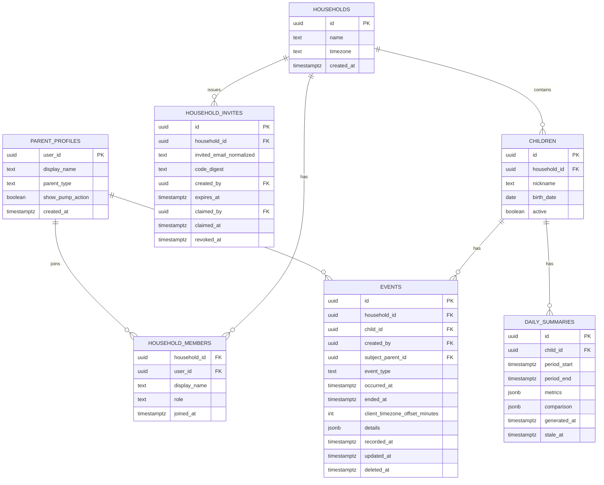

# Baby Log — Product and UX Specification

**Status:** Approved implementation baseline  
**Implementation status:** MVP implementation created; external Supabase and Netlify provisioning remains  
**Primary users:** Two parents using iOS Safari and Android Chrome  
**Hosting target:** Netlify  
**Data and authentication target:** Supabase  
**Last updated:** July 13, 2026

## 1. Product definition

Baby Infant Log is a private, mobile-first web app that lets either parent record infant care events while actively caring for the baby. Its central promise is:

> Open the app, tap one large action, and know the event is safely shared.

The app tracks these eight actions:

1. Poop
2. Pee
3. Feed
4. Burp
5. Sleep / Wake
6. Diaper check
7. Hiccups
8. Pump / End pump

The product is intentionally narrow. Speed, clarity, data safety, and reliable shared state matter more than customization or decorative design.

## 2. Launch scope and assumptions

### 2.1 Accounts and family membership

The first release supports Google Sign-In and standard email-and-password accounts through Supabase Auth. It does not hard-code or allowlist specific email addresses.

- **Parent A** creates an account, a parent profile, and the infant's family record.
- The system generates a short-lived five-character alphanumeric family signup code.
- **Parent B** creates and verifies a separate account, enters the code, reviews the family being joined, and confirms the link.
- Both parents then have equal permission to view, log, edit, and remove events for that family.
- Each account belongs to only one family in the MVP, and each family has one infant and at most two active parent memberships.

The family code creates membership only through a protected server-side claim transaction. It is not a child ID, database key, permanent password, or substitute for Parent B's own authenticated account.

**Family** is the user-facing term. **Household** is the corresponding internal database boundary used in this document's technical sections.

### 2.2 Product assumptions to confirm

This specification makes the following default decisions so implementation can remain unblocked:

- One infant and one household are supported at launch.
- A parent profile type is required: Mother, Father, or Parent/Guardian. This is a display and personalization preference, not an authorization role.
- The 8 PM brief covers the household day from the previous local 8:00 PM through the current local 8:00 PM. This is normally 24 hours and becomes 23 or 25 hours across a daylight-saving change.
- The 8 PM brief is guaranteed to exist in the app. Proactive delivery by email or push notification is not part of the MVP until a delivery channel is chosen.
- Feed, diaper, Pump, and other detailed attributes are optional after the event has already been logged; details never block the first tap.
- Baby nickname is required. Date of birth is optional because the app does not need it for core logging.
- The app provides patterns and factual comparisons, not diagnoses, medical thresholds, or clinical advice.

## 3. Goals and non-goals

### 3.1 Goals

- Log Poop, Pee, Feed, Burp, Diaper check, and Hiccups with exactly one tap from the home screen.
- Start and stop Sleep with one tap for each transition.
- Start and stop Pump with one tap for each transition, then optionally add amount and side.
- Show confirmation immediately, without waiting for the network.
- Keep both parents' screens synchronized within seconds when online.
- Never silently lose a tap during a slow or interrupted connection.
- Make mistakes easy to undo or edit without making every correct action slower.
- Provide readable Day, Week, and Month views for every tracked action.
- Provide a factual live brief anchored at the latest household-local 8 PM, while retaining idempotent completed daily summaries.
- Prevent any user outside the claimed family membership from accessing infant data.
- Work well as a normal browser tab and as an installed home-screen web app.

### 3.2 Non-goals for MVP

- Multiple infants per family or switching between multiple families from one account
- Native iOS or Android apps
- Medical recommendations, alerts, or developmental guidance
- AI-generated health interpretations
- Medication, temperature, growth, milk inventory, or appointment tracking
- Photo uploads, free-form journals, or attachments
- Wearable or smart-device integration
- Complex caregiver roles or custody workflows
- Social features, public sharing, or leaderboards

## 4. Experience principles

1. **The default action is immediate.** A primary CTA records an event; it does not open a form.
2. **Recovery replaces confirmation.** Show Undo after logging rather than asking “Are you sure?” before logging.
3. **One-handed use is the baseline.** Primary actions sit in the easiest thumb-reach area and have large targets.
4. **Status must be unambiguous without adding noise.** The top bar shows Offline only when attention is needed; event-level pending/error states remain visible in activity.
5. **Optional detail stays optional.** A parent can add context after the core timestamp is secure.
6. **Color is supportive, not semantic by itself.** Text, icons, shapes, and status words carry meaning.
7. **Fatigue is expected.** Copy is short, controls are stable, and no important action depends on memory, precision, hover, or long-press.

## 5. Information architecture

The app has three persistent primary destinations:

- **Log:** one-tap actions, current sleep state, sync state, and recent activity
- **History:** chronological event list with edit, delete, and date navigation
- **Insights:** action graphs, Day/Week/Month filters, and daily briefs

Settings are opened from a small text control in the top bar rather than occupying a fourth bottom-navigation item. The control scrolls with the page instead of remaining sticky. While Settings is open, it changes to **Back to log** so the return destination is explicit.

The bottom navigation remains fixed above the device safe area. Labels are always visible; icons are not used without text.

All dropdown controls use the same clearly sized downward chevron with comfortable spacing from the right edge. Volume units are a two-option segmented radio control because both choices can remain visible without opening a menu.

## 6. Primary screen specification

### 6.1 Home / Log screen

```text
┌──────────────────────────────────┐
│ Baby Log               Offline   │  ← only when offline
│ Hi Dad,                           │
│ Baby nickname’s day               │
│                                  │
│ [ Poop ]       [ Pee ]           │
│ [ Feed ]       [ Burp ]          │
│ [ Sleep ]      [ Diaper check ]  │
│ [ Hiccups ]     [ Pump — Mother ] │
│ [ Sleep Interrupted — active ]   │
│                                  │
│ Quick update                     │
│ Last poop 42m · pee 18m · feed 1h│
│                                  │
│ Recent                           │
│ 2:14 PM  Feed              You   │
│ 1:52 PM  Pee          Other parent│
│ 1:08 PM  Wake · slept 48m  You   │
│                                  │
│ Log          History     Insights│
└──────────────────────────────────┘
```

This is a structural wireframe, not a visual style recommendation.

### 6.2 Action grid

- Two columns in portrait mode and three columns only when width comfortably allows it.
- The seven shared actions appear without scrolling on common phone sizes whenever practical.
- Hiccups is a shared action in the fixed seventh position. When Pump is hidden, the empty eighth grid position remains empty rather than stretching or moving Hiccups.
- Pump appears as the optional eighth action using the same width, height, and shape as every other action card. Its visibility is a parent preference and remains stable after onboarding.
- Each button is at least 64 CSS pixels high with at least 12 pixels between targets.
- Button order never changes automatically. Stable placement prevents tired users from tapping the wrong action.
- Each action uses a simple line icon plus a visible text label.
- Do not use emoji as the only iconography because rendering differs across iOS and Android.
- No long-press behavior is required or hidden.
- Press feedback begins immediately and completes in roughly 100–150 ms; there is no decorative animation.

Recommended fixed order:

| Position | Action | Reason |
|---|---|---|
| Top left | Poop | Frequent diaper-related action |
| Top right | Pee | Frequent diaper-related action |
| Middle left | Feed | Frequent care action |
| Middle right | Burp | Naturally adjacent to Feed |
| Bottom left | Sleep / Wake | Stateful action with a changing label |
| Bottom right | Diaper check | Related to but distinct from Poop/Pee |
| Fourth-row left | Hiccups | Shared one-tap episode log; its position never changes |
| Fourth-row right | Pump / End pump | Visible by default for Mother; stateful but visually consistent with the shared action cards |

### 6.3 Standard one-tap event behavior

Poop, Pee, Feed, Burp, Diaper check, and Hiccups follow this sequence:

1. On a valid tap, the browser captures the current client timestamp immediately.
2. A client-generated UUID is assigned before any network request.
3. The recent-activity list updates optimistically.
4. A bottom message appears: **“Pee logged”**, with an **Undo** action.
5. The event is submitted to Supabase.
6. The event-level status clears when acknowledged; the Log header does not continuously display “Saved.”
7. Supabase Realtime updates the other parent's open app.

There is no pre-log modal, amount selector, outcome selector, or confirmation step.

### 6.4 Accidental duplicate protection

- Ignore a second activation of the same CTA from the same device for 600 ms.
- Use the client UUID as the idempotency key so a retry cannot create a duplicate.
- Do not merge events merely because both parents log the same action near the same time; those might be valid independent observations.
- Surface unusually close duplicate events in History for easy cleanup, but do not silently delete them.

### 6.5 Undo and edit

- Undo remains directly available for at least five seconds after logging.
- Undo is implemented as a soft deletion so the system can recover from sync races and preserve auditability.
- Tapping a recent event opens a compact edit sheet for time and optional details.
- Both parents may correct household events. History always shows who originally recorded the event and whether it was edited.

### 6.6 Quick update

- The Log screen shows compact elapsed-time values for the most recent Poop, Pee, and Feed.
- Each value uses the newest non-deleted shared event regardless of which parent recorded it.
- Values use short fatigue-friendly wording such as **18m ago**, **2h 15m ago**, or **1d 4h ago**.
- The elapsed display updates locally and does not write to the database.
- When an action has no history, show **Not logged yet** rather than an invented value.
- Fifteen minutes after the latest Feed, show **No burp yet · Last feed was Xm ago** only when no non-deleted Burp has been recorded after that Feed.
- Either parent's Burp entry clears the reminder immediately; a newer Feed starts a new 15-minute window.

## 7. Action-specific behavior

### 7.1 Poop

Default: record one Poop event at the client timestamp.

Optional post-log details:

- **Size:** Small, Medium, or Large
- **Consistency:** Liquid or Formed
- **Color:** Mustard, Tan, Brown, Orange, Green, Dark green, Red, Pale / white, or Black / tarry

Size is a compact three-option segmented radio control. Consistency is a compact two-option segmented radio control. Each control is left-aligned, at least 44 CSS pixels high, and capped in width so it does not stretch across a desktop sheet. Neither group has a preselected value. A visible **Clear selection** action is available after a value is chosen.

Color uses a three-column grid of small square swatches. The visible swatch is approximately 32 by 32 CSS pixels inside a minimum 44-by-44 touch target. Every swatch has a visible text label, accessible radio semantics, and a selected outline plus checkmark; meaning never depends on color alone. Pale / white retains an Ink border against Paper. The color names are approximate categories, not clinical color matching, and the helper text says **“Choose the closest match.”**

Recommended stored values:

| Visible label | Stored value | UX treatment |
|---|---|---|
| Mustard | `mustard_yellow` | Standard swatch |
| Tan | `tan` | Standard swatch |
| Brown | `brown` | Standard swatch |
| Orange | `orange` | Standard swatch |
| Green | `green` | Standard swatch |
| Dark green | `dark_green` | Standard swatch; visually distinct from Black / tarry |
| Red | `red` | Attention note after selection |
| Pale / white | `pale_white` | Attention note after selection |
| Black / tarry | `black_tarry` | Attention note with newborn meconium exception |

Selecting an attention color shows a concise, non-blocking note while keeping **Save changes** available:

- Red: **“Red may come from food, but it can also be blood. Contact your baby’s pediatrician promptly.”**
- Pale / white: **“Pale, white, or chalky stool needs prompt medical advice. Contact your baby’s pediatrician.”**
- Black / tarry: **“Black stool can be normal during the first few newborn stools. After that, contact your baby’s pediatrician promptly.”**

The app records the parent's observation and does not diagnose the cause. Screen rendering and room lighting make exact color matching unreliable. The normal and attention groupings follow pediatric guidance that yellow, brown, and green ranges are commonly normal, while red, pale/white, and black after the newborn meconium period warrant medical discussion: [American Academy of Pediatrics](https://www.healthychildren.org/English/ages-stages/baby/Pages/The-Many-Colors-of-Poop.aspx) and [Johns Hopkins Medicine](https://www.hopkinsmedicine.org/health/conditions-and-diseases/stool-color-guide).

The first tap always saves the Poop timestamp before details are requested. After an online save, open the optional Poop details sheet automatically. Closing it preserves the event without details. Offline logging remains one tap and defers the editable sheet until the event has synchronized. Recent and History show a compact line only when details exist, for example **“Medium · Liquid · Mustard.”**

### 7.2 Pee

Default: record one Pee event at the client timestamp.

No required details in MVP.

### 7.3 Feed

Default: record that a Feed occurred at the client timestamp.

Optional post-log details:

- Milk type: breast milk, formula, or mixed
- Amount consumed in milliliters

The optional amount uses a touch-friendly 0–350 ml slider with one-milliliter steps and a live value label. The zero position is labelled **Not recorded**. The Feed timestamp is saved on the first tap before its optional details sheet opens. Closing the sheet or choosing **Save without amount** retains the Feed. No amount is interpreted as unknown, not zero.

### 7.4 Burp

Default: record one Burp event at the client timestamp.

No required details in MVP.

### 7.5 Sleep / Wake

Sleep is a stateful CTA:

- When the infant is awake, the button reads **Sleep**.
- Tapping it starts a sleep session using the current client timestamp.
- While sleep is active, the same button reads **Wake · 1h 12m** and uses the Attention state.
- Tapping Wake ends the open sleep session at the current client timestamp.
- The elapsed label is display-only and can update once per minute; it must not cause a network write every minute.
- While Sleep is active, a separate **Sleep Interrupted** control starts an interruption using one tap.
- During an open interruption, that control changes to **Resume sleep · Xm**; one tap closes the interruption without ending the sleep session.
- Tapping Wake while an interruption is open closes both at the same timestamp.
- History, Insights, and the daily brief show net sleep time and interruption count. Gross session timestamps remain preserved.

Concurrency rules:

- Only one open sleep session may exist for a child.
- Only one interruption may be open for that sleep session.
- Starting or ending sleep must use a transactional database operation.
- If both parents tap Sleep nearly simultaneously, one operation succeeds and the other device adopts the already-active sleep state instead of creating a second open session.
- If the app is offline, a sleep transition is queued. On reconnection, conflicts are shown clearly and resolved without silently overwriting timestamps.

### 7.6 Diaper check

Default: record that a diaper was checked at the client timestamp.

Optional post-log outcome:

- Dry
- Wet
- Soiled
- Mixed
- Rash noticed

Poop and Pee remain independent action events. Selecting an outcome must not automatically create additional Poop/Pee events unless a future setting explicitly enables that behavior; implicit event creation would make counts confusing.

### 7.7 Hiccups

Default: record one observed Hiccups episode at the client timestamp.

- One tap represents one episode, not each individual hiccup.
- No detail sheet or required duration is added in this release.
- The confirmation reads **“Hiccups logged”** and includes Undo.
- Either parent may record, edit, or remove the shared event.
- History and Insights use the label **Hiccups** and count episodes neutrally without medical interpretation.

### 7.8 Pump / End pump

Pump is a stateful, parent-specific CTA shown by default on the Mother profile:

- When no pumping session is active, the button reads **Pump**.
- Tapping it starts a Pump session using the current client timestamp.
- While active, it reads **End pump · 12m** and uses the Attention state.
- Tapping End pump closes the session at the current client timestamp and immediately saves the duration.
- After an online save, the Pump details sheet opens automatically; the parent does not need to find the event and open Details separately. An offline completion defers editable details until the session synchronizes.
- The other parent may view and correct Pump records, but the primary Pump CTA is personalized to the Mother profile.

Optional post-log details:

- Total amount
- Unit: milliliters or fluid ounces, remembered as a parent preference
- Start time and end time, prefilled from the session and editable when the parent needs to correct either timestamp
- Left amount and right amount, where useful
- Left, right, or both when only side is being recorded

Rules:

- Amount is never required to end and save a Pump session.
- End time must remain later than start time.
- Total amount uses a slider from 0–60 ml. When fluid ounces are selected, the same upper limit is shown as 2.03 fl oz and the current value is converted immediately.
- The zero position is labelled **Not recorded**.
- If left and right amounts are entered, total is derived automatically; the form does not ask for the same total twice.
- Preserve the entered value and unit, and also store a canonical milliliter value for consistent aggregation and later unit switching.
- Unit selection uses a two-option segmented radio control in both Settings and Pump details rather than a dropdown.
- Missing amount is displayed as “Not recorded” and is never counted as zero.
- Only one open Pump session may exist per pumping parent profile.
- The session is associated with the family and infant for shared insights while retaining the pumping parent's profile ID.
- Pump and Feed remain separate actions; ending Pump must not automatically create a Feed event.
- Offline Pump transitions use the same visible queue and conflict-recovery rules as Sleep.

## 8. Time and event semantics

The user's requirement to capture client time is preserved while retaining a server audit timestamp.

Each event stores:

- `occurred_at`: ISO timestamp captured on the client at tap time
- `recorded_at`: trusted database timestamp assigned when Supabase accepts the write
- `client_timezone_offset_minutes`: device offset at tap time
- `household_timezone`: resolved through the household, stored as an IANA name such as `America/Chicago`
- `created_by`: authenticated Supabase user ID
- `subject_parent_id`: pumping parent profile for Pump events; otherwise null
- `id`: client-generated event UUID used as both the primary key and idempotency key

Rules:

- The UI displays events in the household timezone, not whichever timezone the server uses.
- Editing an event changes `occurred_at` and records `updated_at`; it never rewrites `recorded_at`.
- If the device clock differs substantially from server time, save the event but mark it for review. Do not silently substitute server time because the product explicitly uses client time.
- Day, Week, and Month boundaries use the household timezone.
- Sleep and Pump durations are calculated from timestamp instants, which avoids daylight-saving arithmetic errors.

## 9. Shared and offline behavior

### 9.1 Online shared state

- An acknowledged event appears on the other parent's open screen through an authenticated, household-scoped Supabase Realtime channel.
- The recent list identifies the recording parent using a short display name, never the full email address.
- Realtime is an enhancement, not the only source of truth. The app refetches the latest household state on focus, reconnect, and session restoration.

### 9.2 Optimistic and offline queue

The app must not silently discard an event because of poor connectivity.

- Pending events are stored in IndexedDB under the authenticated user and household.
- A pending event remains visibly marked **Syncing** or **Offline**.
- Retries occur when the browser reports online, when the tab returns to the foreground, and when the app is reopened.
- Retry uses the same UUID, making it safe to submit more than once.
- A failed authorization or household-membership check is never retried indefinitely; it shows **Needs attention** and asks the user to sign in again.
- Do not depend exclusively on Background Sync because behavior is not uniform across iOS Safari and Android Chrome.
- The local queue contains only the minimum event payload. Avoid locally caching emails, full profiles, or unnecessary sensitive details.

## 10. Feedback and error states

### Install nudge

- Mobile users who are not already running the installed app are eligible before or after login.
- Wait 5 seconds before showing a compact, non-modal banner above bottom navigation; suppress it during loading and password recovery.
- Android uses the browser's native install prompt after the parent selects **Add to Home Screen**.
- iPhone and iPad show **Tap Share, then Add to Home Screen** because iOS does not expose the same programmable prompt.
- **Not now** suppresses the nudge only for the current browser session.

| State | UI treatment | Parent action |
|---|---|---|
| Saved | Activity has no warning; no persistent success label | None |
| Syncing | Small spinner plus “Syncing”; event remains visible | None |
| Offline | Attention-colored “Offline · events will sync” | Continue logging |
| Needs attention | Persistent short message beside affected event | Retry or sign in |
| Undo complete | “Event removed” with brief Restore action | Optional restore |
| Email not verified | “Check your email to finish creating your account.” | Resend after cooldown |
| Invalid family code | “That code is invalid, expired, or already used.” | Re-enter or ask Parent A for a new code |
| Join rate limited | “Too many attempts. Try again in 15 minutes.” | Wait; Parent A may rotate the code |
| Sleep conflict | “Sleep was already started at 2:14 PM.” | Keep existing time or edit |
| Pump conflict | “A pump session is already active.” | Continue or correct the existing session |

Never show raw Supabase, Postgres, authentication, SMTP, or Netlify error text to the parent. Preserve technical detail only in protected logs.

## 11. History

History is a reverse-chronological list grouped by household date.

Each row shows:

- Action label and icon
- Local time
- Parent display name
- Duration for completed sleep sessions
- Net duration and interruption count for completed sleep sessions
- Edited, Offline, or Needs attention status when applicable

Controls:

- Today is the default.
- Previous and Next use full text with directional arrows, unboxed 44-pixel touch targets, and a date label on its own row at narrow mobile widths.
- Next is disabled while Today is selected so the parent cannot accidentally browse into empty future dates.
- Filter by action using a compact selector; “All” is the default.
- Selecting a row opens Edit and Remove actions.
- Empty state: **“No events logged for this day.”**

The main one-tap logging grid does not disappear when History is opened via browser Back; navigation state must behave predictably.

## 12. Insights and graph interface

### 12.1 Controls

The Insights screen has three controls in this order:

1. **Action dropdown:** All Actions, Poop, Pee, Feed, Burp, Sleep, Diaper check, Hiccups, Pump
2. **Range segmented control:** Day, Week, Month
3. **Period navigator:** Previous, a centered period label, and Next

**All Actions** is the first option and the default when Insights opens. It is an option inside the existing Action dropdown, not a second dropdown. The selected action and range are expressed in visible text and accessible state, not color alone.

Mobile control layout:

```text
Action
[ All Actions                         ▾ ]

[ Day | Week | Month ]

← Previous       Mon, Jul 13       Next →
                    Today
```

Period navigation rules:

- Day moves exactly one household calendar day at a time and labels the selection, for example **Mon, Jul 13**.
- Week moves one Monday-through-Sunday window at a time and labels the inclusive dates, for example **Jul 13–19**.
- Month moves one household calendar month at a time and labels it, for example **July 2026**.
- Previous and Next are unboxed text-and-arrow controls with minimum 44-pixel touch targets; do not place tiny arrows inside square buttons.
- Next is disabled when the selected period contains Today. Future empty periods are not browsable.
- When viewing a past period, a compact **Today** action returns directly to the current Day, Week, or Month without changing the selected action.
- Changing Action preserves the selected range and period. Changing range preserves the anchor date and opens the Day, Week, or Month containing that date.
- The lightweight client keeps roughly 13 months (400 days) available for interactive Insights. Previous is disabled before the earliest fully loaded period and a plain-language note explains the limit; this prevents a period from appearing empty merely because it was not loaded.
- All period boundaries and labels use the household timezone, including daylight-saving transitions.
- Real-time updates change the current visible period without resetting the parent's selected controls.

### 12.2 All Actions overview

All Actions uses labeled small multiples rather than overlaying eight series. Counts, durations, and volumes have different units, so a combined y-axis would be visually busy and mathematically misleading.

- Show a compact **At a glance** summary followed by one graph row or section for every action in fixed Log-screen order: Poop, Pee, Feed, Burp, Sleep, Diaper check, Hiccups, Pump.
- Every action remains visible, including an action with no entries. Its row says **“No entries”** rather than disappearing and shifting the order.
- Pump remains visible in shared Insights even when the current parent's Pump logging CTA is hidden.
- Each action heading includes its visible name, line icon, semantic chart color, and exact headline value. Color is never the only identifier.
- Selecting **View details** on an action changes the Action dropdown to that action while retaining the current Day, Week, or Month and selected period.
- The single-action view places an unboxed **← Back to all actions** control immediately above the selected-action summary. It returns to All Actions without changing the range or period, then restores focus to the originating **View details** control so the parent does not need to rediscover the dropdown or lose their place.

Range-specific All Actions presentation:

- **Day:** one shared 24-hour axis with an aligned row for every action. Discrete actions use dots; Sleep and Pump use duration blocks. Alignment makes it easy to see sequences such as Feed, Burp, Hiccups, and Sleep without merging their data.
- **Week:** one compact seven-bar chart per action, aligned Monday through Sunday. Each section states the period total; Sleep and Pump additionally show total duration, and Feed/Pump show recorded volume when available.
- **Month:** one compact daily spark-bar chart per action using 28–31 thin day columns. The month total appears in text. Exact dates and values remain available in the single-action detail view rather than crowding every miniature chart.
- On narrow phones, action sections are one column and vertically scroll. Each action card is compact by default and still shows the action name, headline total, and graph; collapsing a card must never hide its primary insight.
- Tapping the card header or its **Show daily breakdown** control expands that action in place. Week expands to seven labeled daily values. Month expands to a compact calendar-style daily breakdown grouped by week so all dates remain readable without a 31-row list.
- Only one action card may be expanded at a time on narrow phones. Expanding another card collapses the previous one and keeps the newly expanded heading in view. Changing the range or period returns every card to its compact state.
- Expanded cards provide a visible **Hide daily breakdown** control and retain a separate **View details** action. The expand control has a minimum 44-pixel touch target, an accessible expanded/collapsed state, and a chevron whose direction reinforces the current state.
- At wider widths, two columns are allowed only when labels and values remain readable without horizontal scrolling. Cards may remain expanded independently when the layout has sufficient room.
- In a two-column layout, cards that share a visual row must keep their graph frames, time-axis labels, and **View details** actions vertically aligned. The title-and-summary area uses the height of the taller card in that row, so a wrapped two-line headline such as Feed or Sleep does not push its graph below the graph beside it.
- Insight headlines must wrap naturally without clipping, truncation, or overlapping the graph. If a headline needs more than two lines, the paired row grows to fit the taller card; alignment must not depend on action-specific margins or hard-coded copy lengths.
- In the single-column mobile layout, cards return to natural content height without reserving desktop-only blank space. The spacing from headline to graph, graph to axis, and axis to **View details** remains consistent across every action.
- The overview does not repeat every exact event-time list beneath all eight graphs. Each section exposes an accessible summary and **View details** action; the selected single-action view provides the complete list/table.

### 12.3 Single-action chart mapping

| Action | Day | Week | Month | Headline metric |
|---|---|---|---|---|
| Poop | Dots on 24-hour timeline | Count per day | Count per day | Count and median interval |
| Pee | Dots on 24-hour timeline | Count per day | Count per day | Count and median interval |
| Feed | Dots on 24-hour timeline | Count per day | Count per day | Count, median feed interval, and recorded ml |
| Burp | Dots on 24-hour timeline | Count per day | Count per day | Count |
| Sleep | Horizontal sleep intervals | Net hours per day | Net hours per day | Net sleep, sessions, interruptions, longest stretch |
| Diaper check | Dots on 24-hour timeline | Count per day | Count per day | Checks and optional outcomes |
| Hiccups | Dots on 24-hour timeline | Episode count per day | Episode count per day | Episodes and median interval when at least two exist |
| Pump | Horizontal session intervals | Sessions, total minutes, optional volume | Sessions, total minutes, optional volume | Sessions, duration, recorded volume |

### 12.4 Shared graph requirements

Graph requirements:

- Never overlay all actions on one plot. All Actions uses separately labeled, aligned small multiples; selecting one action opens the detailed graph.
- Day uses a clearly labeled 24-hour axis. Discrete events appear as dots; Sleep and Pump appear as duration blocks.
- Every single-action Day chart includes an exact list of event times or session start/end times directly below it.
- Week and Month use horizontal daily rows with a readable date on the left and the exact count or duration on the right.
- A short sentence above the chart explains what longer bars, dots, or blocks mean.
- Always pair the visual with a short text summary and an accessible data table or list.
- Grid lines use Ink at low opacity. A selected point uses an outline, visible text, and Attention rather than a color-only change.
- No 3D charts, gradients, animated sweeps, or decorative illustrations.
- Tooltips must also work by tap and keyboard, not hover only.
- Month data may scroll horizontally only if labels cannot remain legible; the page itself must not overflow horizontally.
- Show “Not enough data yet” rather than inventing a trend.

Semantic chart palette:

| Action | Chart color | Hex |
|---|---|---|
| Poop | Rust brown | `#8A4F39` |
| Pee | Ochre | `#9A6A00` |
| Feed | Blue | `#286A8A` |
| Burp | Purple | `#6C4D91` |
| Sleep | Indigo | `#445C8A` |
| Diaper check | Green | `#3F7352` |
| Hiccups | Berry | `#9A4668` |
| Pump | Terracotta | `#985336` |

These colors are reserved for chart marks and legends; they do not expand the general button, status, or typography palette. The separate Poop observation swatches are literal recorded-color choices rather than chart-series colors. Every chart color has at least 4.5:1 contrast against Paper. Action names, icons, fixed ordering, and exact values remain present so parents with color-vision differences do not need to distinguish colors to understand the view.

### 12.5 Aggregation rules

- Event frequency is a count in the selected period.
- Median interval requires at least two events.
- Hiccups frequency counts recorded episodes, not individual physical hiccups.
- Sleep session count is based on sessions that start in the period.
- Sleep duration is the portion of each session overlapping the period, so cross-midnight sleep is divided correctly.
- Sleep interruption overlap is subtracted from duration; interruption count is reported separately.
- An open sleep session contributes provisional duration through the earlier of now or the report end and is labeled ongoing.
- Pump session count is based on sessions that start in the period; duration is clipped to the selected period like Sleep.
- Pump volume totals include only sessions with an entered amount. The summary states how many sessions are missing an amount.
- Week begins Monday unless the household setting is changed later.
- Month is the household calendar month.

### 12.6 Downloadable PDF report

A secondary **Download PDF** action appears beneath the period navigator whenever Insights is available. It remains visible for **All Actions** and every individual action; parents do not need to return to All Actions before downloading.

The report follows the currently visible Insights scope:

- **All Actions:** download one complete report containing the At a glance summary and a clearly separated section for Poop, Pee, Feed, Burp, Sleep, Diaper check, Hiccups, and Pump.
- **Individual action:** download a focused report containing only the selected action.
- **Day, Week, or Month:** use the currently selected household period and timezone exactly as shown on screen. A current incomplete period is labeled **“Through [generated time]”** rather than presented as complete.

Download behavior:

1. The parent taps **Download PDF** once.
2. The button changes to **Preparing report…** and prevents a duplicate request while generation is in progress.
3. Synced entries from both parents are queried for the selected child and period. If local entries are still pending, the app first attempts to sync them and states **“Syncing recent entries before preparing your report.”**
4. The completed PDF is downloaded with a readable filename such as `Abel-insights-2026-07-13-to-2026-07-19.pdf`. On iOS Safari, opening the generated PDF in a browser preview is acceptable when the browser does not download it directly; the page provides the plain instruction **“Tap Share, then Save to Files.”**
5. A failure leaves the current Insights selection untouched and shows **“We couldn’t prepare the report. Try again.”** with a Retry action.

The button is disabled while offline because an authoritative shared report must include the latest synchronized entries from either parent. The UI explains **“Connect to the internet to download a report.”** It must not silently export an incomplete local-only report.

PDF content and presentation:

- Baby name, report scope, selected dates, household timezone, and generation timestamp
- A concise text summary before charts
- The same action colors, labels, units, calculations, and missing-data explanations used in Insights
- Readable charts followed by exact text tables so the report remains understandable when printed in grayscale or viewed without relying on color
- Sleep interruptions, ongoing-session labels, optional Feed/Pump amounts, and optional Poop observations where applicable
- Page numbers and a footer stating **“Generated from Baby Log. This is a family record, not medical advice.”**
- No parent email addresses, authentication data, invitation information, or internal identifiers

PDF generation is an authenticated, on-demand operation. A Netlify Function validates the Supabase access token and active household membership, queries only the authorized child and selected period, generates the PDF, and streams it directly to the parent. A conservative server-side rate limit protects this CPU-heavy action from repeated requests. The generated file is not placed in a public URL or retained in Supabase Storage by default. Server logs must not contain event details or the rendered PDF body.

## 13. Latest brief and completed 8 PM summaries

### 13.1 Live reporting window

The Insights screen begins with an always-visible **Latest brief** covering the most recent 8:00 PM in the saved household timezone through the current time. It is a live view of the family's shared entries, not a completed previous-day report.

- Before today's 8:00 PM, the window begins at yesterday's 8:00 PM and the timeframe reads **“Since 8 PM yesterday · updated through [time]”.**
- At or after today's 8:00 PM, the window resets to today's 8:00 PM and the timeframe reads **“Since 8 PM today · updated through [time]”.**
- The brief includes entries recorded by either parent and remains independent of the selected action, Day/Week/Month range, and historical period.
- Sleep and Pump sessions that overlap the boundary are clipped to the window. Open sessions contribute time through now and are labeled ongoing. Sleep interruptions are clipped, merged where necessary, and subtracted from sleep duration.
- The visible cutoff advances at least once per minute while Insights is open. Realtime event and interruption updates refresh the brief without resetting any Insights controls.
- The 8 PM boundary is resolved in the household timezone, including daylight-saving transitions. Calendar-day charts remain separate and continue to use midnight boundaries.

### 13.2 Content

The live brief contains only meaningful, non-zero activity lines, such as:

- **Feeds:** count, typical gap when at least two feeds exist, recorded volume, and any missing amounts
- **Sleep:** net duration, session count, ongoing status, and interruption count
- **Diaper care:** only the non-zero pee, poop, and diaper-check counts
- **Burps and Hiccups:** a line only when at least one was recorded
- **Pump:** session count, duration, ongoing status, recorded volume, and any missing amounts

Rules for meaningful insights:

- Do not show a wall of zero-valued sentences. If the entire window is empty, show **“No entries since 8 PM [today/yesterday]. The brief will update as care is logged.”**
- Do not claim that an incomplete live window is a completed day or compare it with a completed period.
- Avoid “normal,” “abnormal,” “healthy,” “concerning,” or medical threshold language.
- Display missing-data caveats where a conclusion depends on optional logging.

### 13.3 Completed-summary generation and idempotency

Completed household-day summaries remain a server-side historical record and future notification source. Each completed summary covers the household day ending at 8:00 PM; for example, the July 11 summary covers July 10 at 8:00 PM through July 11 at 8:00 PM. On a daylight-saving transition, elapsed duration may be 23 or 25 hours while both visible boundaries remain local 8:00 PM. These stored summaries do not replace or delay the live **Latest brief**.

- A Netlify Scheduled Function runs on a UTC cron schedule every 15 minutes.
- Each invocation selects households whose local time has reached 8:00 PM and whose brief for that local period does not exist.
- A unique key on child plus `period_end` prevents duplicate briefs.
- The function calculates metrics server-side and stores the brief in Supabase.
- If an invocation fails, the next scheduled run retries the missing brief.
- Each run checks the latest 31 household-day windows and repairs up to three missing briefs, allowing a multi-day outage to recover over subsequent scheduled runs without creating a large one-run workload.
- The function is safe to run manually in staging or from the Netlify dashboard.
- Historical edits cause the affected brief to be marked stale and recalculated on demand or by the next maintenance pass.

Netlify scheduled functions execute cron in UTC, so a single hard-coded “8 PM” cron would shift relative to local time during daylight-saving changes. The timezone-aware polling approach avoids that problem.

### 13.4 Delivery

MVP behavior:

- **Latest brief** is visible at the top of Insights at every time of day and is calculated from the shared entries already available to the app.
- New entries from either parent update the brief through the existing private Realtime event streams.
- If the app is closed, the latest window is recalculated from shared storage the next time Insights opens.

Future delivery options, requiring a product decision and provider setup:

- Email both parents at 8 PM
- Web push notification, with separate iOS installation and permission UX
- A short notification with a link to the full in-app brief

The core app must not imply that a notification was delivered unless the provider confirms delivery.

## 14. Onboarding and household isolation

### 14.1 Assessment of the authentication and code model

This is a sound family-linking model and is easier to generalize beyond two hard-coded accounts. Google Sign-In reduces password friction, while email/password remains available as a fallback and requires email verification, password reset, SMTP delivery, password rules, and signup abuse protection.

The recommended version has two important safeguards:

1. Parent A enters Parent B's email when generating the code, so the invitation is bound to that exact normalized email.
2. Parent B must authenticate with their own verified Google or email/password account before the code can be validated or claimed.

This means a copied, guessed, or mistyped code cannot link an unrelated verified account. The five-character code confirms possession of the invitation; it is not the only proof of identity.

### 14.2 Entry screen

The unauthenticated entry screen has three plain actions:

- **Log in**
- **Create a family — Parent A**
- **Join a family — Parent B**

The labels Parent A and Parent B describe onboarding order only. They do not create different long-term permissions.

After selecting an entry action, the parent sees **Continue with Google** followed by an **or continue with email** divider and the email/password form. The Join journey tells Parent B to use the Google account that received the invitation.

### 14.3 Parent A — create a family

The flow is intentionally divided into short screens with a visible progress label such as **Step 1 of 4**. Back preserves entered values, and closing the browser allows verified users to resume incomplete onboarding.

#### Step 1 — Account

Account options:

- **Continue with Google**
- Email
- Password
- Confirm password

Behavior:

- Preserve the selected Create journey across the Google redirect.
- Treat the verified email returned by Google as the account email.
- Normalize email for comparisons while preserving the entered address for display.
- Provide one Show/Hide password control that applies predictably.
- Allow paste and password-manager autofill.
- Validate inline without clearing either field.
- After submission, show **“Check your email”** with the address, **Resend email** after cooldown, and **Change email**.
- Do not create a family, infant, or invitation until the email is verified.

#### Step 2 — Parent profile

Fields:

- Display name
- Parent type: Mother, Father, or Parent/Guardian

Parent type personalizes language and Pump visibility. It never grants database permission and must not be used by RLS as an authorization claim.

#### Step 3 — Baby and family

Fields:

- Baby name or nickname — required
- Date of birth — optional
- Household timezone — detected and shown for confirmation

The server transaction creates the household, Parent A membership, and infant together. A partial failure must not leave an inaccessible infant or ownerless household.

#### Step 4 — Invite Parent B

Fields and actions:

- Parent B email — required to generate the recommended email-bound code; Parent A may choose **Invite later**
- Generated five-character code
- Copy icon beside the code with a 44-pixel touch target and **Copy family code** accessible name
- **Email invitation** — optional and initiated only when Parent A chooses it
- **Share code** using the device share sheet when available
- Expiration shown in plain language

Code generation never sends email automatically. Email and Share use the same active code and do not rotate it. The email identifies the inviter using the authenticated parent's saved display name and contains numbered instructions to open Baby Log, choose **Join a family — Parent B**, authenticate with the invited email, enter the code, review the family, and select **Join family**. It does not contain the baby's name, either parent's password, care data, or a database identifier.

Completion opens the Log screen. Until Parent B joins, Settings continues to show **Invite Parent B**.

### 14.4 Parent B — join a family

#### Step 1 — Account

Parent B continues with the invited Google account or enters Email, Password, and Confirm password, then verifies the email. If Parent B already has an account without a family, they log in instead of creating another account. The selected Join journey is preserved across the Google redirect.

#### Step 2 — Parent profile

Parent B enters Display name and chooses Mother, Father, or Parent/Guardian.

#### Step 3 — Family code

- Use one normal text input, not five separate boxes.
- Accept paste, ignore spaces and hyphens, and convert letters to uppercase.
- Show the expected format, for example `7K3QP`.
- The entered account email must match the email bound to the invitation.
- Invalid, expired, used, revoked, and email-mismatched codes use the same external error message.

#### Step 4 — Confirm family

After the server validates the code and bound email, show only the minimum confirmation context:

- **“Join [baby nickname]'s family?”**
- Parent A's display name
- **Join family** and **Cancel**

Join family performs a single transaction that creates Parent B membership and consumes the invitation. Only after this transaction succeeds may Parent B query infant or event data.

### 14.5 Login and account recovery

Login fields:

- Email
- Password
- Show/Hide password
- **Forgot password?**

Requirements:

- Persist a secure Supabase session so normal daily use does not require repeated login.
- Require email verification before family creation or invitation redemption.
- Password reset email returns to a dedicated Set new password screen.
- Changing a password requires a recent login or reauthentication.
- Resend confirmation and reset controls have visible cooldowns.
- Authentication errors do not reveal whether an email address has an account.
- Signing out clears local household caches and pending records only after warning about any unsynced events.

### 14.6 Five-character code specification

Requested format:

- Exactly five uppercase alphanumeric characters
- Use a non-ambiguous alphabet such as `ABCDEFGHJKMNPQRSTUVWXYZ23456789`
- Example: `7K3QP`
- Generated using a cryptographically secure random source on the server

Security rules:

- Bind the invitation to Parent B's normalized verified email.
- Expire it after 24 hours.
- Allow one successful claim only.
- Allow only one active code per household; rotating it immediately revokes the old code.
- Regenerate on collision so the same active code is never issued to two households at once.
- Parent A can revoke or regenerate it from Settings.
- Parent A may email the active code only through a separate authenticated CTA. The server reads the recipient from the invite row and never accepts a replacement recipient during delivery.
- The server reads Parent A's display name from the authenticated parent profile for the email subject and instructions; the browser cannot supply or override it.
- A successful email delivery starts a server-enforced 30-minute cooldown for the household, including replacement codes. The Email invitation CTA shows the remaining time and disables itself until the server timestamp expires, while Copy and Share stay available.
- Failed delivery does not start the 30-minute successful-send cooldown. Email attempts remain separately rate-limited, and delivery failure leaves the code valid and visible for Copy or Share.
- Store only an HMAC/digest made with a server-held secret, not the raw code.
- Validate and claim only through an authenticated server function; never expose the invitation table to the browser.
- Rate-limit attempts by authenticated account and IP, with a recommended maximum of five failed attempts per 15 minutes followed by cooldown.
- Require CAPTCHA on account signup and password recovery to make creation of guessing accounts more expensive.
- Return a generic failure response so callers cannot distinguish nonexistent, expired, used, revoked, or email-mismatched invitations.
- Refuse self-claim, a third active parent, or an account that already belongs to a different household.
- Enforce the two-parent limit and one-time claim with database constraints, not only client checks.

Security recommendation:

- The non-ambiguous 31-character alphabet provides 28,629,151 possible five-character codes.
- Six characters provide 887,503,681 possibilities with almost no additional user burden.
- Five characters is acceptable for this email-bound, verified, short-lived, heavily rate-limited private workflow. Six remains the recommended production default if the product expands.

### 14.7 Isolation guarantees

- Signup alone grants no infant access.
- Creating a family grants access only to the new household through Parent A's membership.
- Entering a valid code does not grant access until the transactional claim succeeds.
- Invitation rows are server-only and excluded from normal client grants.
- Every household query remains protected by membership-based Row Level Security after the invitation is consumed.
- A code is never placed in a URL, analytics event, browser log, or long-lived local storage.
- Revoking Parent B membership immediately blocks future database and Realtime access after session refresh; sensitive settings should force reauthentication.

## 15. Security and privacy model

### 15.1 Authentication

- Use Supabase Auth Google OAuth and email-and-password signup and login.
- Store the Google client secret only in Supabase; never expose it through Netlify, source code, or a `VITE_` variable.
- Preserve Create or Join intent across OAuth redirects and clear stale intent for a normal login.
- Require email confirmation before family creation or invitation redemption.
- Configure a production SMTP provider for confirmation and password-reset messages; Supabase's built-in sender is suitable only for initial testing.
- Use a minimum password length of 12 characters, allow long passphrases and password-manager values, and do not block paste.
- Enable leaked-password protection when the selected Supabase plan supports it.
- Enable CAPTCHA on signup and password recovery and retain Supabase Auth rate limits.
- Configure exact production confirmation and password-reset redirect URLs. Restrict Netlify preview redirects to controlled preview domains.
- Store only Supabase's managed password hash; application tables and Netlify Functions must never receive or store plaintext passwords.
- Keep parent type in the protected application profile. Do not place user-editable profile metadata in authorization logic.

### 15.2 Authorization

Every user-facing table has Row Level Security enabled. The policy model is:

> An authenticated user may access a row only when an active `household_members` record exists for `auth.uid()` and the row's `household_id`.

Additional requirements:

- Inserts force `created_by = auth.uid()`.
- A child must belong to the same household as the event.
- Normal updates cannot change `household_id`, `child_id`, or `created_by`.
- Parent profiles and household membership remain household-scoped; invitation rows are not readable through the public client API.
- The Supabase service-role key exists only in Netlify's protected function environment and never in the browser bundle.
- Realtime channels are private and household-scoped.
- Soft-deleted events are excluded by default but remain household-protected.

### 15.3 Data minimization and operations

- Store a baby nickname rather than requiring a legal name.
- Make date of birth optional.
- Do not add free-form notes in MVP; they expand the sensitive-data surface and are not needed for core logging.
- Redact emails, access tokens, and event details from client and function logs.
- Enable database backups appropriate to the chosen Supabase plan and document restore testing before launch.
- Provide a future export/delete path before expanding beyond the two-user private release.
- Do not claim HIPAA, medical-device, or clinical compliance.

## 16. Proposed data model



Recommended constraints:

- Unique membership on `(household_id, user_id)`
- One active household membership per user in MVP
- No more than two active parent memberships per household
- At most one active invitation per household
- Active invitation code digest unique; generation retries on collision
- Invitation claim unique and single-use; invited email compared normalized and case-insensitively
- Unique event UUID generated on the client
- Event type restricted to the eight supported types: Poop, Pee, Feed, Burp, Sleep, Diaper check, Hiccups, and Pump
- Hiccups is a discrete event: `ended_at` and `subject_parent_id` remain null and `details` defaults to an empty object
- `ended_at` allowed only for Sleep and Pump and must be later than `occurred_at`
- At most one non-deleted open Sleep event per child
- At most one non-deleted open Pump event per pumping parent profile
- `subject_parent_id` required for Pump and null for non-Pump events
- Unique daily summary on `(child_id, period_end)`
- Household timezone validated as an IANA timezone identifier

Because the deployed MVP check constraint predates Hiccups, implementation requires a new forward-only migration that replaces the event-type constraint. Do not edit an already-applied initial migration. Poop size, consistency, and color remain optional keys inside the existing `details` JSONB and do not require new table columns.

## 17. Proposed technical architecture

### 17.1 Frontend

Recommended stack:

- Svelte 5 with Vite and TypeScript
- Static single-page app deployed to Netlify CDN
- Supabase JavaScript client for Auth, database operations, and Realtime
- A small service worker/PWA layer for app-shell caching
- IndexedDB for the pending write queue
- A tree-shaken Chart.js build or purpose-built accessible SVG charts; select after a small implementation spike

Why this direction:

- Svelte compiles away much of the framework runtime and fits the small interactive surface.
- A client-rendered static app avoids unnecessary server rendering and keeps Netlify deployment simple.
- Direct Supabase access with strict RLS removes an extra network hop from the most frequent action: logging an event.
- A chart implementation spike is preferable to committing the product to a large charting dependency before verifying sleep intervals and mobile accessibility.

### 17.2 Backend responsibilities

Supabase owns:

- Email-and-password authentication, session management, verification, and password reset
- Postgres persistence
- Row Level Security
- Transactional household creation and invitation claim operations
- Transactional Sleep and Pump start/stop operations
- Realtime household updates

Netlify Functions own:

- Five-character invitation generation, digesting, rate-limited validation, and claim orchestration
- Parent-controlled transactional invitation email delivery using the same active code
- Authenticated on-demand Insights PDF generation and private response streaming
- Scheduled 8 PM brief generation
- Optional future email/push delivery
- Any future server-only operation that requires the Supabase service-role key

Routine event writes should not pass through a Netlify Function unless later requirements demand centralized server validation beyond RLS and database constraints.

### 17.3 High-level flow

```text
Parent A signup
  → authenticate with Google or create an email/password account
  → obtain a verified account email
  → create profile + household + infant transactionally
  → server generates email-bound, expiring invitation code

Parent B signup
  → authenticate with a separate verified Google or email/password account
  → enter code through rate-limited server function
  → preview family
  → transactional claim consumes code + creates membership

Parent tap
  → capture client time + UUID
  → optimistic UI + IndexedDB pending record
  → Supabase insert/RPC under user JWT
  → Postgres constraints + household RLS
  → acknowledgment clears pending state
  → private Realtime update reaches other parent

Netlify scheduled function
  → finds household at local 8 PM without a brief
  → reads authorized events using server credential
  → calculates deterministic metrics
  → upserts one idempotent daily summary
  → Realtime makes the brief available to open clients

Parent downloads Insights report
  → sends selected action, range, and anchor date with Supabase access token
  → Netlify Function validates the session and active household membership
  → reads the authorized shared event snapshot
  → generates the matching All Actions or single-action PDF
  → streams the private file without storing a public copy
```

## 18. Minimal visual system

Only these four base colors are used for application chrome, buttons, text, borders, focus, status, and surfaces. Opacity variants are allowed for borders and grid lines. The action-specific chart palette in Section 12 and the observational Poop color swatches in Section 7.1 are narrow semantic-data exceptions; they must not spread into navigation, buttons, backgrounds, or decorative styling.

| Token | Hex | Use | Contrast against Paper |
|---|---|---|---|
| Paper | `#FAFAF7` | Page and surface background | — |
| Ink | `#161616` | Text, borders, icons | 17.31:1 |
| Action | `#2F6F64` | Primary action fill, chart data, saved focus | 5.61:1 |
| Attention | `#9B4A35` | Offline, active Sleep, errors, selected data | 5.86:1 |

Rules:

- Use the device system font stack. No custom font download.
- Default body text is at least 16 CSS pixels.
- Inputs use at least 16 CSS pixels to avoid focus zoom on iOS Safari.
- No gradients, shadows, glass effects, textured backgrounds, branding illustrations, decorative cards, or ornamental footer.
- No pill-shaped controls. Corner radius is 0–4 pixels.
- No autoplay animation or shimmer skeletons.
- Pressed and focus states use border, fill, and text changes rather than motion alone.
- Focus outlines remain visible.
- Error and success states always include a word or icon, not color alone.

## 19. Mobile and PWA requirements

### 19.1 iOS Safari

- Verify email-confirmation and password-reset links return to the correct app screen rather than opening an unusable blank tab.
- Support iCloud Keychain/password-manager autofill without moving or covering form controls.
- Respect `env(safe-area-inset-top)` and `env(safe-area-inset-bottom)`.
- Keep controls usable when launched from Add to Home Screen.
- Provide short, manual Add to Home Screen instructions; do not show them on every visit.
- Retry queued writes on foreground because background execution may be suspended.
- Test viewport changes when the address bar and keyboard appear.

### 19.2 Android Chrome

- Support the browser install prompt when eligible, without blocking app use.
- Verify standalone display, back navigation, keyboard behavior, and offline queue recovery.
- Avoid browser-specific vibration or haptic feedback as a requirement; optional vibration must respect user settings and degrade safely.

### 19.3 Shared baseline

- Mobile portrait is primary; landscape remains functional.
- No hover-only functionality.
- Support widths down to 320 CSS pixels without horizontal page scrolling.
- Use `touch-action: manipulation` where appropriate and prevent accidental double activation.
- Preserve event entry through refresh, browser suspension, and temporary network loss.
- Respect reduced-motion and increased text-size preferences.

Initial support target:

- Current and previous two major iOS Safari releases, with a practical minimum of iOS 17
- Current and previous two major Android Chrome releases, with a practical minimum of Chrome 120
- Final support is confirmed by testing the parents' actual devices before launch

## 20. Accessibility requirements

- Target WCAG 2.2 AA for the private app.
- Every action has a visible label and an accessible name.
- Touch targets are at least 44 by 44 CSS pixels; primary CTAs exceed this at 64 pixels high.
- Keyboard focus order follows visual order.
- Live regions announce “Feed logged,” sync failures, and successful undo without stealing focus.
- Graphs include text summaries and accessible tabular/list equivalents.
- The active Sleep button exposes pressed/state text such as “Sleep active, started 1:12 PM.”
- The active Pump button exposes state text such as “Pump active, started 1:12 PM.”
- Time strings include enough context for screen readers and do not rely only on abbreviations.

## 21. Performance and reliability targets

| Measure | Target |
|---|---|
| Tap to visible local confirmation | Under 100 ms |
| Online tap to server acknowledgment | p95 under 1.5 s on a normal mobile connection |
| Cross-device update after acknowledgment | p95 under 2 s |
| Cached repeat launch to interactive | Under 1 s on a representative phone |
| Initial production JavaScript | Target under 150 KB gzip; hard review at 200 KB |
| Lost acknowledged events | Zero |
| Duplicate event from automatic retry | Zero |
| Daily brief duplication | Zero through database uniqueness/idempotency |

Reliability behavior is more important than meeting a numeric speed target. If a server write is slow, the app remains responsive and clearly shows that the event is pending.

## 22. Analytics and observability

Avoid third-party behavioral analytics for the private MVP unless explicitly requested.

Operational telemetry should include only what is needed to detect failures:

- Netlify function invocation ID, household UUID, period end, duration, and success/failure
- Counts of pending-queue retry failures without event detail
- Supabase database and Auth logs with short retention appropriate to debugging
- Client error reports stripped of emails, tokens, infant profile data, and event details

Do not record CTA taps in a separate analytics platform; the actual authorized event row is sufficient product evidence.

## 23. Acceptance criteria

### 23.1 One-tap logging

- From an authenticated Log screen, each non-stateful action is recorded by one tap.
- One Hiccups tap records one observed episode and immediately offers Undo.
- The visible timestamp matches the client tap time in the household timezone.
- A confirmation and Undo action appear immediately.
- Optional details never interrupt the save.
- Since-last Poop, Pee, and Feed values reflect the newest shared entry from either parent.

### 23.2 Sleep

- One tap starts Sleep and changes the CTA to Wake.
- One tap on Wake closes the same session.
- Simultaneous starts cannot create two open sessions.
- Sleep Interrupted and Resume sleep each take one tap while Sleep is active.
- Concurrent taps cannot create two open interruptions.
- Wake safely closes an open interruption and the sleep session together.
- History, Insights, and the daily brief subtract interruptions from sleep duration.
- Sleep crossing midnight is plotted and summarized correctly.

### 23.3 Pump

- A Mother profile sees Pump by default without changing the seven shared action positions.
- One tap starts Pump and changes the CTA to End pump.
- One tap ends the session and saves its duration without requiring an amount.
- Amount, unit, and side can be added after the session is already saved.
- Pump amount uses the 0–60 ml slider or its converted 0–2.03 fl oz range.
- Pump history and insights are visible to both parents, and a missing amount is never treated as zero.

### 23.4 Shared use

- Parent A and Parent B can sign in independently with verified Google or email/password accounts.
- A saved event from one device appears on the other open device without refresh.
- Events from both parents remain attributed and ordered by occurrence time.
- Concurrent legitimate events are retained.

### 23.5 Isolation

- A verified account without household membership receives no child, event, summary, or Realtime data.
- A code cannot be claimed by an account whose verified email differs from the invitation email.
- Expired, used, revoked, guessed, self-claimed, or third-parent codes create no membership.
- An authenticated test user without membership receives no household, child, event, summary, or Realtime data.
- Changing a request's household or child ID cannot cross the RLS boundary.
- Supabase service credentials are absent from browser assets and source maps.

### 23.6 Offline and recovery

- A tap made offline remains visible and marked Offline.
- Reopening the app with connectivity syncs the same event once.
- Signing in again allows a blocked queue to retry without changing occurrence time.
- A failed event is never shown as Saved.

### 23.7 Insights and brief

- Each action can be viewed by Day, Week, and Month.
- All Actions is the default Insights option and shows every action as a separately labeled small multiple rather than an overlaid multi-unit chart.
- On a narrow phone, All Actions cards initially show their headline and graph in a compact state; one card can be expanded at a time to reveal its daily breakdown without leaving the overview.
- At multi-column breakpoints, one-line and wrapped multi-line headlines do not create staggered graph positions: paired graph frames, axes, and detail actions remain aligned while all summary text stays readable.
- Previous and Next cycle through complete household Day, Week, or Month periods; Next is disabled for the current period and Today returns from a historical period in one tap.
- Changing action preserves the selected range and period, while changing range preserves the anchor date.
- A visible **Back to all actions** control returns from a single-action detail view while preserving the selected range and period and restoring focus to the originating card.
- Sleep and Pump use duration while discrete actions use frequency; Feed and Pump also show recorded volume where available.
- Download PDF is available for All Actions and every individual action and exports the currently selected Day, Week, or Month.
- A report uses synchronized shared entries, matches the visible household period and timezone, excludes private account data, and is never exposed through a public file URL.
- Latest brief covers the most recent household-local 8 PM through now, includes entries from either parent, survives Insights filter changes, omits zero-only categories, and handles daylight-saving transitions.
- Open Sleep and Pump sessions and Sleep interruptions are clipped to the live window and represented as ongoing where applicable.
- Re-running the scheduled function does not duplicate the brief.
- Brief wording stays descriptive and non-medical.

### 23.8 Mobile UX

- Primary actions are usable with one hand on the parents' actual iOS and Android phones.
- The action grid does not shift after a log.
- The page does not horizontally overflow at 320 CSS pixels.
- Email confirmation and password-reset links return to the app successfully in Safari and Chrome.
- Installed PWA and normal browser modes both work.

## 24. Testing plan

The optional `supabase/scripts/seed-30-day-newborn-ui-data.sql` fixture creates a deterministic, tagged 30-day newborn-like history for visual QA, including varied Poop size/consistency/color observations and Hiccups episodes. Reruns replace only fixture-owned rows and preserve manual events. The fixture is synthetic test data, not medical guidance or a clinical record.

### 24.1 Automated

- Unit tests for time windows, DST transitions, intervals, and summary calculations
- Unit tests for optimistic queue state and idempotent retry
- Database tests for every RLS action and cross-household denial
- Database tests for concurrent Sleep and Pump start/stop
- Integration tests for signup, email verification, login, password reset, and session restoration
- Invitation tests for correct claim, wrong email, wrong code, expiry, rotation, reuse, simultaneous claims, rate limits, and third-parent rejection
- End-to-end tests for log, undo, edit, offline recovery, History, and Insights
- Component tests for optional Poop segmented controls, accessible color-swatch names/selection, clear behavior, and attention-color guidance
- End-to-end tests for Hiccups one-tap logging, Undo, shared-device synchronization, History, and counts
- Insights tests for All Actions small multiples, return-from-details focus and filter preservation, compact and expanded mobile cards, single-expanded-card behavior, one-line versus wrapped-headline graph alignment at two-column breakpoints, natural-height single-column cards, action-color labels, period navigation, current-period Next disabling, live-brief filter independence, open-session clipping, empty-state copy, and household-timezone boundaries
- PDF report tests for All Actions and every individual action, Day/Week/Month boundaries, current-period labeling, cross-household denial, pending-sync handling, private response headers, filenames, and iOS/Android download behavior
- Accessibility checks plus manual keyboard and screen-reader review

### 24.2 Device testing

Test on the actual devices used by both parents, not only emulators:

- Wife's iPhone in Safari browser mode
- Wife's iPhone from Add to Home Screen
- Husband's Android phone in Chrome browser mode
- Husband's Android phone as an installed PWA
- Both devices open simultaneously on Wi-Fi
- One device on cellular and one on Wi-Fi
- Airplane-mode log followed by reconnection
- App backgrounded before and after a queued event
- Google and email/password session restoration after multiple days
- Email verification and password reset opened from the device's mail app
- Daylight-saving transition calculations using automated clock fixtures

## 25. Implementation phases

### Phase 0 — Project and security foundation

- Initialize Svelte/Vite/TypeScript and Netlify configuration
- Create Supabase local configuration and versioned migrations
- Configure Google OAuth plus email/password Auth, confirmation/reset redirects, CAPTCHA, password rules, and production SMTP
- Create schema, invitation digest/claim functions, constraints, and RLS policies
- Add automated cross-household security tests before UI work

### Phase 1 — Fast shared logging

- Build login, recovery, Parent A creation, Parent B joining, and resumable onboarding
- Build fixed seven shared actions, including Hiccups, plus the personalized Pump CTA
- Implement one-tap events, Sleep/Pump transactions, optimistic UI, Undo, and recent list
- Add optional post-save Poop size, consistency, and accessible color controls without delaying the first tap
- Add Realtime updates between parents
- Verify simultaneous use on both actual devices

### Phase 2 — Reliability and history

- Add IndexedDB pending queue and foreground retry
- Add History filters, edit, and soft delete
- Add PWA manifest/app-shell caching and installation guidance
- Verify refresh, suspension, offline, and session-expiry recovery

### Phase 3 — Insights and daily brief

- Implement aggregation queries and accessible charts
- Implement All Actions small multiples, single-action detail charts, and Day/Week/Month period navigation
- Implement idempotent Netlify scheduled brief generation
- Add in-app 8 PM brief and Realtime availability update
- Validate DST and cross-midnight sleep behavior

### Phase 4 — Launch hardening

- Performance and bundle review
- Accessibility review
- Backup/restore exercise
- Production SMTP, confirmation, password-reset, CAPTCHA, and redirect verification
- Privacy review and log redaction
- Final parent-device acceptance test

## 26. Expected future file areas

This is a planning map, not a request to create these files now.

```text
src/
  components/       action grid, event rows, feedback, chart controls
  features/         auth, onboarding, invitations, events, sleep, pump, history, insights, briefs
  lib/              Supabase client, time, validation, IndexedDB queue
  stores/           session, household, event/sync state
  styles/           four-color tokens and global mobile styles
  App.svelte

netlify/functions/
  family-invite.*   secure generation, validation, rate limiting, and claim
  daily-summary.*   timezone-aware, idempotent scheduled calculation

supabase/
  migrations/       tables, constraints, RLS, invitation claims, summary queries
  tests/             RLS and database behavior

tests/
  unit/
  e2e/

static/
  manifest and minimal PWA icons
```

## 27. Decisions required before implementation

These choices can change visible behavior or infrastructure and should be confirmed before code begins:

1. **Completed-summary delivery:** keep stored 8 PM summaries in-app only, or add email or web push later?
2. **Baby profile:** should date of birth remain optional?
3. **Household timezone:** confirm `America/Chicago` for launch or provide the correct IANA timezone.
4. **Parent display names:** confirm the short names shown in activity and reports.
5. **Event correction:** should either parent be able to edit/remove any event, as recommended, or only events they recorded?
6. **Code length:** keep the requested five characters with the documented protections, or use the recommended six characters?
7. **Invitation binding:** confirm that Parent A must provide Parent B's email before a code is generated, as recommended.
8. **Pump visibility:** show Pump only for Mother by default, with a setting to expose it for another parent profile?
9. **Pump units:** choose milliliters or fluid ounces as the launch default; each parent can change the remembered preference.
10. **Production email:** choose the SMTP provider used for verification and password-reset email.

## 28. Official platform references

- [Supabase: Password-based authentication](https://supabase.com/docs/guides/auth/passwords)
- [Supabase: Password security](https://supabase.com/docs/guides/auth/password-security)
- [Supabase: Email templates](https://supabase.com/docs/guides/auth/auth-email-templates)
- [Supabase: CAPTCHA protection](https://supabase.com/docs/guides/auth/auth-captcha)
- [Supabase: Auth rate limits](https://supabase.com/docs/guides/auth/rate-limits)
- [Supabase: Redirect URLs](https://supabase.com/docs/guides/auth/redirect-urls)
- [Supabase: Row Level Security](https://supabase.com/docs/guides/database/postgres/row-level-security)
- [Supabase: Realtime database changes](https://supabase.com/docs/guides/realtime/subscribing-to-database-changes)
- [Netlify: Scheduled Functions](https://docs.netlify.com/build/functions/scheduled-functions/)
